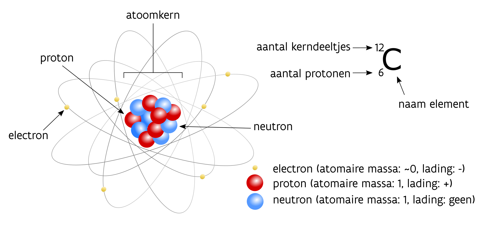
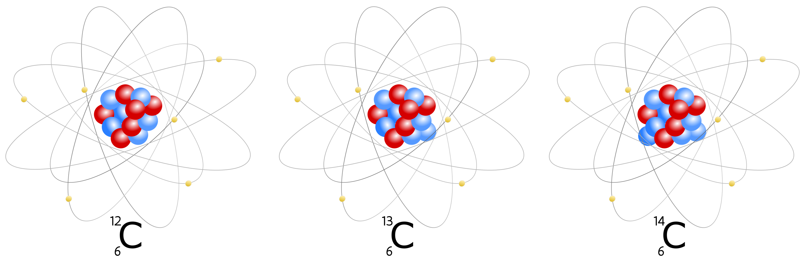

# Het principe van een ^14^C-datering {#principes}

## Het chemisch element koolstof

Eerst en vooral kan wat duidelijkheid scheppen in de gangbare terminologie geen kwaad. Veelal worden ‘radiokoolstof’ en de notaties C-14, C14 , 14C of koolstof-14 vlot door en naast elkaar gebruikt. Volgens internationale afspraken binnen de scheikunde is $\mathrm{ ^{14}C}$ echter de enige correcte afgekorte benaming voor radiokoolstof. Het is de weerslag van de chemische karakterisatie van het element koolstof dat met de hoofdletter $\mathrm{C}$ (van carbon) is opgenomen in het periodiek systeem der elementen, ook wel de tabel van Mendelejev genoemd. In die tabel staan de gekende chemische elementen geordend volgens het aantal protonen in hun atoomkern (= het atoomnummer). Het aantal protonen in de atoomkern bepaalt immers het element. Koolstof heeft atoomnummer 6, wat wil zeggen dat dit element 6 protonen heeft in zijn kern en 6 elektronen die cirkelen rond die kern (figuur 1). Doorgaans betekent dit dat er ook 6 neutronen aanwezig zijn in de kern, en dat wordt genoteerd als $\mathrm{^{12}_6C}$ waarbij 12 het totale aantal kerndeeltjes (protonen en neutronen) weergeeft en 6 het aantal protonen. Vrijwel alle massa bevindt zich in de atoomkern (protonen en neutronen).

```{r atoommodel, fig.cap='Het atoommodel voor koolstof', echo = FALSE, out.width='80%', fig.asp=.75, fig.align='center'}



```

Daarnaast bestaan er varianten van koolstof met meer kerndeeltjes, bijvoorbeeld met 7 ($\mathrm{ ^{13}_6C}$) en 8 ($\mathrm{ ^{14}_6C}$) neutronen in de kern (figuur 2). Die varianten van eenzelfde element worden isotopen genoemd. Bij de koolstofatomen in de aardse atmosfeer bestaat het overgrote deel (98,9%) uit de variant met 12 kerndeeltjes (6 protonen + 6 neutronen) en bestaat slechts 1,1% uit $\mathrm{ ^{13}C}$ (6 protonen + 7 neutronen). De isotoop $\mathrm{ ^{14}C}$ is een derde, maar uiterst zeldzaam fenomeen in vergelijking met $\mathrm{ ^{12}C}$, en zelfs $\mathrm{ ^{13}C}$. Zo kan men in de atmosfeer doorgaans slecht één $\mathrm{ ^{14}C}$-isotoop vinden op 1.000.000.000.000 (duizend miljard) atomen koolstof. Aangezien er meer kerndeeltjes aanwezig zijn bij $\mathrm{ ^{13}C}$ en $\mathrm{ ^{14}C}$ (respectievelijk één of twee extra neutronen, met atomaire massa 1), zijn dit ook zwaardere isotopen in vergelijking met de meest courant voorkomende $\mathrm{^{12}C}$.

```{r atoommodelIsotopen, fig.cap='Atoommodel voor drie isotopen van het element koolstof. De isotopen ^13^C en ^14^C hebben respectievelijk één en twee neutronen (blauw) meer in hun atoomkern dan de meest courante koolstofisotoop ^12^C. Het aantal protonen (rood) blijft gelijk.', echo = FALSE, out.width='80%', fig.asp=.75, fig.align='center'}



```

>
> **In de atmosfeer tref je slecht één $\mathrm{^{14}C}$-isotoop aan op 1.000.000.000.000 atomen koolstof.**
>

Isotopen van een element verschillen dan wel in het aantal kerndeeltjes (dus in hun natuurkundige kenmerken), maar de chemische reacties die ze aangaan met andere atomen worden daardoor niet beïnvloed. Ze reageren met andere woorden op een gelijkaardige manier met andere atomen en moleculen, en vormen er samen identiek dezelfde (nieuwe) chemische stoffen mee. Koolstof reageert bijvoorbeeld samen met zuurstof tot de molecule koolstofdioxide ($\mathrm{CO_2}$), ongeacht welke koolstofisotoop betrokken is in deze chemische reactie.


## Het ontstaan van radiokoolstof

$\mathrm{^{14}C}$ is de zwaarste isotoop van koolstof die in de natuur voorkomt. Hij wordt gevormd in de bovenste laag van de atmosfeer, op ca. 15 km hoogte, door de interactie van zogenaamde ‘thermische neutronen’ (n) met stikstofatomen (meer bepaald de isotoop ($\mathrm{^{14}_7N}$) met 7 protonen en 7 neutronen in de kern). De thermische neutronen worden gevormd als gevolg van kosmische straling die de dampkring binnendringt. Ze hebben voldoende energie om een proton (p) uit de kern van een stikstofatoom te verdringen, en daarvan de plaats in te nemen. Hierdoor ontstaat een koolstofatoom met 14 kerndeeltjes (6 protonen + 8 neutronen): de $\mathrm{^{14}C}$-isotoop.


$$n + \mathrm{^{14}_7N} \rightarrow \mathrm{^{14}_7C} + p$$

De productie van $\mathrm{^{14}C}$ blijft wel miniem en wordt wereldwijd geschat op niet meer dan 7,5 kg per jaar. Eens zich een $\mathrm{^{14}C}$-isotoop gevormd heeft, zal dit met de in de lucht aanwezige zuurstofmoleculen oxideren tot koolstofdioxide ($\mathrm{^{14}CO_2}$). Deze moleculen vermengen zich met $\mathrm{CO_2}$ die is opgebouwd met de courante $\mathrm{^{12}C}$-isotopen en samen komen ze in de koolstofcyclus terecht (figuur 3).

```{r koolstofcyclus, fig.cap='Vereenvoudigde voorstelling van de koolstofcyclus. (© KIK/IRPA, Brussel)', echo = FALSE, out.width='80%', fig.asp=.75, fig.align='center'}

knitr::include_graphics("./figuren/figuur_03.png")

```


## De koolstofcyclus

Koolstof is de essentiële bouwsteen voor alle leven op aarde. Elk levend organisme neemt koolstof op en verwerkt het bij de opbouw van nieuwe cellen. Planten doen dit via fotosynthese – nemen zowel $\mathrm{^{12}C}$, $\mathrm{^{13}C}$ en $\mathrm{^{14}C}$ op – en vormen op zich een voedselbron voor mens en dier. De hele voedselketen is dan ook van koolstof doordrongen, van de kleinste eencelligen tot vleeseters pur sang.

Een gigantische ‘voorraad’ aan koolstof zit echter opgeslagen in de oceanen. Daar kan de opgeslagen koolstof, onder de vorm van carbonaten (verbindingen van koolstof en zuurstof, samen met calcium), de grondstof vormen waaruit koralen, schelpen en vele kleine organismen zijn opgebouwd.

>
> **Koolstof is de essentiële bouwsteen voor alle leven op aarde. Elk levend organisme neemt koolstof op en verwerkt het bij de opbouw van nieuwe cellen.**
>

De $\mathrm{CO_2}$ die door levende wezens wordt opgeslagen, komt uiteindelijk weer vrij wanneer hun organisch materiaal na de dood vergaat. Maar daarom wordt die vrijgekomen CO2 nog niet onmiddellijk in de atmosfeer opgenomen. Koolstof uit planten en dieren kan worden weggespoeld in waterlopen, opgenomen in de bodem of in organische afzettingen zoals veen, via grondwaterbewegingen verplaatst, of simpelweg gevangen blijven in organisch materiaal dat aan desintegratie ontsnapt en zo deel van het archeologisch bodemarchief wordt. Constructiehout dat droog en gevrijwaard blijft van schimmel of ernstige insectenvraat kan eeuwenlang zijn mechanische eigenschappen behouden en een structurele functie blijven uitoefenen in historische gebouwen, en zo de in het hout vastgelegde koolstof uit de koolstofcyclus onttrekken. 

Een totaal ander en heel specifiek (menselijk) proces, dat relevant is in het erfgoedonderzoek maar buiten de natuurlijke koolstofcyclus staat, vormt de aanmaak van kalkmortel. Tijdens dit proces wordt ongebluste kalk (bereid door het branden van kalksteen of schelpen) gemengd met water en zand, en wordt koolstof uit de atmosfeer (onder de vorm van $\mathrm{CO_2}$) vastgelegd in de mortel (Hajdas et al. 2017). Later kan die $\mathrm{CO_2}$ door verwering weer vrijkomen. Ook bij de productie van andere materialen, zoals ijzer of loodcarbonaat, kan koolstof gevangen worden. Deze materialen dateren is daardoor in sommige gevallen wel mogelijk, al berust dit voorlopig nog op experimenteel onderzoek (zie 4.1).


## Radioactiviteit

Door een uitgesproken onevenwicht in de verhouding van neutronen en protonen in de atoomkern kunnen bepaalde isotopen onstabiel zijn. Ze ondergaan vroeg of laat een spontane transformatie waarbij een vorm van straling vrijkomt. Dit spontane proces wordt omschreven als radioactief verval. In het geval van de instabiele isotoop $\mathrm{^{14}C}$ stoot één van de neutronen tijdens dit proces een electron ($e^-$) en een anti-neutrino ($v$) uit, en wordt zo een proton. Daardoor transformeert het instabiele koolstofisotoop (met 6 protonen en 8 neutronen in de kern) in een stabiel stikstofisotoop, met 7 protonen en 7 neutronen in de kern. 


$$\mathrm{^{14}_6C} \rightarrow \mathrm{^{14}_7N} + e^{-} + \bar{v}{_e}$$

Bij levende wezens, die koolstof rechtstreeks uit de atmosfeer assimileren of die onrechtstreeks door de inname van voedsel verwerven, bouwt zich een dynamisch evenwicht op tussen de opname van $\mathrm{^{14}C}$ en het radioactief verval ervan. In levende wezens stralen er $\mathrm{^{14}C}$-isotopen weg maar komen er ook steeds nieuwe bij. En vermits levende wezens hun eigen structuren steeds weer vernieuwen (afbreken en heropbouwen) is het interne gehalte aan $\mathrm{^{14}C}$ in overeenstemming met dat in de atmosfeer. Bij het overlijden van een dier of persoon, of het afsterven van een plant, wordt dit dynamisch evenwicht echter verbroken. Op dat moment blijft het gehalte aan $\mathrm{^{14}C}$-isotopen in het stoffelijk overschot of de organische resten dalen, door het radioactieve verval, maar komen er geen nieuwe meer bij. Bij het overlijden begint als het ware een interne klok te lopen: de radioactieve isotopen ‘tikken weg’ en worden niet meer aangevuld.

Nu is de snelheid waarmee het radioactief verval verloopt, constant en gekend. Ze wordt beschreven door een parameter die men de halfwaardetijd noemt, de tijd nodig om van alle aanwezige $\mathrm{^{14}C}$-atomen nog de helft over te houden. De meest accurate bepaling van de halfwaardetijd van $\mathrm{^{14}C}$-isotopen is 5730 (±40) jaar. Dit betekent dat na 5730 jaar gemiddeld de helft van de originele hoeveelheid $\mathrm{^{14}C}$-isotopen is gedesintegreerd. Na nog eens 5730 jaar zal opnieuw gemiddeld de helft van de nog aanwezige onstabiele isotopen vervallen zijn tot stabiele stikstof en blijft er dus slechts een kwart meer over van de originele hoeveelheid $\mathrm{^{14}C}$ (figuur 4). 

```{r halfwaardetijd, fig.cap='Evolutie van het ^14^C-gehalte in functie van de tijd.', echo = FALSE, out.width='80%', fig.asp=.75, fig.align='center'}

knitr::include_graphics("./figuren/figuur_04.png")

```

Tijdens de beginjaren van het onderzoek naar de toepassingsmogelijkheden van radiokoolstof werd de halfwaardetijd wat minder precies bepaald en kwam men tot een waarde van 5568 (±30) jaar. Aangezien de preciezere bepaling van de halfwaardetijd pas jaren later werd uitgevoerd, en er ondertussen al heel wat radiokoolstofdateringen waren gerapporteerd, heeft men ervoor gekozen toch verder te werken met de oude, minder precieze halfwaardetijd (Stuiver & Polach 1977). Op zich is dit geen groot probleem, aangezien de kalibratiecurves (zie verder) hiermee rekening houden.


## Ouderdom bepalen

Het bepalen van de ouderdom van een stukje organisch of anorganisch materiaal steunt op het meten van het aandeel aan radioactieve isotopen die (nog) aanwezig zijn in het materiaal. Het meten van de hoeveelheid $\mathrm{^{14}C}$-isotopen is echter geen sinecure en vereist precisie-instrumenten (want $\mathrm{^{14}C}$ is uitermate zeldzaam, zie eerder). Proportionele gastellers en detectoren op basis van vloeistof-scintillatie waren de eerste toestellen die in staat waren de radioactiviteit van een staal te meten, wat dan een maat was voor het gehalte aan $\mathrm{^{14}C}$ Vanaf de jaren 1980 bood Accelerated Mass Spectrometry (AMS) echter de mogelijkheid om in plaats van de radioactiviteit rechtstreeks de verschillende isotopen ($\mathrm{^{12}C}$, $\mathrm{^{13}C}$ en $\mathrm{^{14}C}$) zelf te tellen, op basis van het verschil in hun massa. Deze techniek is daardoor in staat meteen de verhoudingen $\mathrm{^{14}C}/\mathrm{^{12}C}$ of $\mathrm{^{13}C}/\mathrm{^{12}C}$ in het onderzochte staal te bepalen. Momenteel komen vernieuwde en compacte versies van AMS-machines op de markt, bijvoorbeeld de MICADAS (*Mini carbon dating system*, ™IONplus) (figuur 5). Deze toestellen laten toe om met grote precisie de verhouding van de verschillende koolstofisotopen te meten voor zeer kleine stalen, in slechts enkele uren tijd. Ze hebben het bijkomend voordeel dat ze veel minder plaats innemen dan de oude AMS-toestellen, minder energie verbruiken, eenvoudiger te bedienen zijn en een beduidend lagere onderhoudskost hebben.

```{r MICADAS, fig.cap='Opstelling van een MICADAS aan het KIK/IRPA te Brussel. (© KIK/IRPA, Brussel)', echo = FALSE, out.width='80%', fig.asp=.75, fig.align='center'}

knitr::include_graphics("./figuren/figuur_05.jpg")

```

De radiokoolstofouderdom van een organisch staal wordt steeds gerapporteerd in jaren BP (before present). Deze term verwijst naar het aantal jaren voor het arbitraire jaar 0, wat initieel het jaar was waarin de $\mathrm{^{14}C}$-datering werd uitgevoerd. Al snel werd before present vastgelegd als het aantal jaar vóór 1950 - niet geheel toevallig omdat in december 1949 de eerste wetenschappelijke publicatie met radiokoolstofdateringen verscheen (Arnold & Libby 1949). Sindsdien worden alle $\mathrm{^{14}C}$-dateringen in BP uitgedrukt. Dat we ondertussen al lang na 1950 zijn wordt bij de rapportage van een datering uiteraard in rekening gebracht.

Om de radiokoolstofouderdom van een stuk organisch materiaal te berekenen, wordt de verhouding van de oorspronkelijke radioactiviteit van het onderzochte materiaal en de gemeten (resterende) radioactiviteit vergeleken met een internationale standaard, die de theoretische radiokoolstof-activiteit van het jaar 0 (= 1950 AD) benadert. Bij AMS-metingen doet men hetzelfde maar met de directe tellingen van de isotopen als maatstaf, in plaats van de radioactiviteit.
Met de huidige meetinstrumenten kan men zelfs bij 50.000 jaar oud materiaal nog de aanwezige $\mathrm{^{14}C}$ detecteren. Bij het dateren van dergelijk oud materiaal (>40.000 BP) moeten we ons bewust zijn dat we op de detectielimiet balanceren en (vooral) dat een uiterst minieme verontreiniging van het onderzochte materiaal (bv. met recentere koolstof) het dateringsresultaat compleet kan verstoren. In nog ouder materiaal is het $\mathrm{^{14}C}$-gehalte te klein om nog betrouwbaar gemeten te kunnen worden en moet er beroep gedaan worden op andere dateringstechnieken.


## Meetfout en statistische onzekerheid

De kwaliteit van een radiokoolstofdatering wordt bepaald door de precisie en accuraatheid van het meetresultaat. Een resultaat is precies wanneer herhaalde metingen van een zelfde fenomeen steeds bijna dezelfde uitkomst geven. Een resultaat is accuraat als de metingen overeenkomen met de werkelijke waarde (figuur 6).

Beide parameters worden enerzijds bepaald door de meetonzekerheid en anderzijds door de meetfout. De meetonzekerheid ontstaat doordat herhaalde metingen van hetzelfde staal steeds verschillende, licht afwijkende waarden zullen geven. Dit is geen meetfout, maar een eigenschap van het radioactieve proces. Deze meetonzekerheid is bij AMS-metingen en radiometrische analyses te beschrijven met een normaalverdelingscurve of Gauss-curve. Men noemt dit ook een waarschijnlijkheidsverdeling. De klokvorm van de verdeling wordt bepaald door twee parameters: het gemiddelde ($\mu$) en de standaardafwijking ($\sigma$ of sigma) op dit gemiddelde. Een radiokoolstofdatering zal daardoor steeds gerapporteerd worden als een gemiddelde waarde, uitgedrukt als de radiokoolstofouderdom van het onderzochte staal in jaren BP, én de onzekerheid op deze ouderdom uitgedrukt door de standaardafwijking (± $\sigma$). De grootte van de standaardafwijking bepaalt in grote mate de precisie van de meting. Een grote standaardafwijking betekent een ruimer bereik waarin de werkelijke ouderdom te situeren is. Deze standaardafwijking wordt enkel bepaald door het meetproces, waarin de grootte van het onderzochte staal, de meettijd en de ouderdom van het staal een rol spelen.

```{r precisie, fig.cap='Visuele voorstelling van accuraatheid en precisie, aan de hand van een schietschijf.', echo = FALSE, out.width='80%', fig.asp=.75, fig.align='center'}

knitr::include_graphics("./figuren/figuur_06.png")

```

De normaalverdeling heeft enkele interessante eigenschappen (figuur 7). Zo kan het wiskundig aangetoond worden dat 68,2% van alle metingen binnen het bereik van $\mu-\sigma$ tot $\mu+\sigma$ zullen liggen. Nemen we dit interval rond het gemiddelde iets ruimer, namelijk 2 x de standaardafwijking langs elke zijde, dan liggen 95,4% van de metingen binnen dit interval. Het komt erop neer dat bij 20 herhaalde metingen op hetzelfde staal, 19 keer de werkelijke ouderdom binnen het 2-sigma interval zal liggen (95 op 100 gevallen). Bijgevolg is dit bij 1 op de 20 meting niet het geval en zal de werkelijke ouderdom dus verder afwijken van de meting. Alhoewel de precieze afbakening van dit 95,4% betrouwbaarheidsinterval geen wiskundige of fysische betekenis heeft, kunnen we intuïtief meestal overweg met deze onzekerheid. Dat wordt duidelijker als we vergelijken met de range van 1 x de standaardafwijking rond het gemiddelde. Dan moeten we er rekening mee houden dat op 20 herhaalde metingen op hetzelfde staal, iets minder dan 14 keer de werkelijke ouderdom binnen het 1-sigma interval zal liggen (68 op 100 gevallen). Met de nauwe range (1-sigma) is de datering strakker omschreven maar de onzekerheid van die inschatting is vrij groot. Met de bredere range (2-sigma) is de datering breder omschreven maar is die inschatting veel betrouwbaarder.

>
> **Een 95,4% betrouwbaarheidsinterval wil zeggen dat bij 20 herhaalde analyses op hetzelfde staal, de gemeten radiokoolstofouderdom 19 keer binnen dat interval zal liggen.**
>

Daarnaast kunnen meetfouten ontstaan door toevallige en systematische fouten in het laboratorium. Men kan deze opsporen door een staal met gekende ouderdom meermaals te meten. Niet-systematische fouten, waarbij een staal de ene keer iets te oud en de andere keer iets te jong dateert, zijn het moeilijkst om in het laboratorium te corrigeren. Daarom gaan de meeste laboratoria hun meetonzekerheid iets verhogen. Met andere woorden verlagen laboratoria hun precisie om rekening te houden met de laboratoriumfouten. Systematische fouten daarentegen beïnvloeden de accuraatheid en moeten absoluut vermeden worden door regelmatig blanco’s en stalen met gekende ouderdom te meten en – uiteraard – uiterst nauwgezet te werk te gaan in het laboratorium.

Soms ervaart een onderzoeker die een datering laat uitvoeren een gebrek aan accuraatheid (of een vermoeden daarvan) maar is dit niet de verantwoordelijkheid van het dateringslaboratorium. Een radiokoolstofanalyse dateert immers een materiaal terwijl de erfgoedonderzoeker vooral geïnteresseerd is in de gebeurtenis die geassocieerd is met dit materiaal. Hoe beter beiden bij elkaar aansluiten, hoe accurater de datering van de gebeurtenis zal zijn. Soms is de relatie tussen materiaal en gebeurtenis echter verstoord door fenomenen zoals residualiteit, intrusiviteit en complexe depositiegeschiedenissen (zie 4.5). Een uitgekiende bemonsteringsstrategie en selectie van het meest geschikte materiaal is dan ook van het grootste belang (zie hoofdstuk 4).

```{r normaalverdeling, fig.cap='De normaalverdeling met karakteristieke parameters, *µ* = het gemiddelde en *σ* = de standaardafwijking.', echo = FALSE, out.width='80%', fig.asp=.75, fig.align='center'}

knitr::include_graphics("./figuren/figuur_07.png")

```


## Isotopenfractionatie

Meet men de verhouding van koolstofisotopen in de atmosfeer ($\mathrm{CO_2}$) en in planten, dan blijken er in planten verhoudingsgewijs minder zwaardere isotopen ($\mathrm{^{13}C}$ en $\mathrm{^{14}C}$) aanwezig zijn. Er worden dus iets meer lichte isotopen dan zware isotopen opgenomen tijdens de fotosynthese. Daardoor zal in nieuw gevormd plantenmateriaal een kleiner aandeel aan $\mathrm{^{14}C}$ te vinden zijn in vergelijking met de atmosfeer waaruit de koolstof, onder de vorm van $\mathrm{CO}_2$, werd gehaald. Er treedt dus een kleine verschuiving op in de onderlinge verhouding van de lichtere $\mathrm{^{12}C}$ t.o.v. de zwaardere isotopen $\mathrm{^{13}C}$ en $\mathrm{^{14}C}$. Dit fenomeen wordt omschreven als isotopenfractionatie. 

Fractionatie komt voor op elk niveau in de voedselketen (de zogenaamde trofische niveaus). Planten worden gegeten door dier en mens. Tijdens de spijsvertering wordt het plantenmateriaal afgebroken tot kleinere componenten die op hun beurt, via complexe biochemische processen, weer de bouwstenen vormen voor nieuwe, nu dierlijke of menselijke weefsels. Bij deze biochemische reacties treedt opnieuw isotopenfractionatie op, maar nu in de andere richting dan bij de fotosynthese. De zwaardere isotopen zijn deze keer in het voordeel. Deze processen worden per trofisch niveau herhaald en zorgen ervoor dat hoe hoger men zich in de voedselketen bevindt, hoe groter de aanrijking is met zwaardere koolstofisotopen ten opzichte van het plantenmateriaal onderaan de voedselketen. Een toppredator, die kleinere carnivoren eet, die op hun beurt kleine dieren verorberen welke hun voeding uit planten halen, zal verhoudingsgewijs meer zware koolstofisotopen in zich dragen dan een dier onderaan de voedselketen. Aangezien er door dit proces van fractionatie meer $\mathrm{^{14}C}$ in een organisme zal ‘ingebouwd’ worden, leidt dit tot een schijnbare ‘verjonging’ in radiokoolstofjaren van het organisme ten opzichte van de verorberde prooien.

De fractionatie wordt gemeten door de verhouding $\mathrm{^{13}C}/\mathrm{^{12}C}$ te meten t.o.v. een standaard, en wordt uitgedrukt als ($\delta \mathrm{^{13}C}$, uitgedrukt in promille, ‰). Het is nu zo dat deze waarde steeds de helft bedraagt van de fractionatie van $\mathrm{^{14}C}/\mathrm{^{12}C}$, wat betekent dat als de ($\delta \mathrm{^{13}C}$ met een bepaalde waarde verschoven is, de fractionatie van $\mathrm{^{14}C}/\mathrm{^{12}C}$ dat met een dubbele waarde zal gedaan hebben. Het meten van de $\delta \mathrm{^{13}C}$ laat op die manier toe voor de $\mathrm{^{14}C}$-metingen een correctie voor de fractionatie uit te voeren. Voor de atmosferische $\mathrm{CO_2}$ is de waarde voor $\delta \mathrm{^{13}C}$ gelijk aan -8‰ (dus een lagere verhouding dan de algemene standaard, die als nulpunt dient). Bij planten kunnen er drie grote groepen onderscheiden worden. De meest voorkomende planten in West Europa volgen een heel gelijkaardig biochemisch proces tijdens de fotosynthese (ze worden C-3 planten genoemd) en hebben daardoor ook gelijkaardige $\delta \mathrm{^{13}C}$-waarden van ongeveer -23‰. Voor hout en houtskool is de isotopenfractionatie t.o.v. de internationale standaard gelijk aan -25‰. De zogenaamde C-4 planten (zoals maïs, grassen en gierst, die door een ‘alternatieve’ fotosynthese beter droogte kunnen weerstaan) nemen het meest efficiënt de zwaardere isotopen op, wat resulteert in een minder negatieve $\delta \mathrm{^{13}C}$ van -10‰. Indien er geen correctie wordt uitgevoerd om de hierboven beschreven processen te compenseren, kan er een afwijking tot 200 jaar in de radiokoolstofouderdom sluipen.

>
> **Een dier dat hoog in de voedselketen staat, zal verhoudingsgewijs meer zware isotopen – en dus ook $\mathrm{^{14}C}$ – in zich dragen dan een dier onderaan de voedselketen.**
>

Het radiokoolstoflaboratorium rapporteert steeds de radiokoolstofouderdom rekening houdend met de isotopenfractionatie. We spreken dan over een conventionele radiokoolstofdatering. Het is steeds deze ouderdomsbepaling die moet gekalibreerd worden (zie hoofdstuk 3) om de radiokoolstofouderdom om te zetten in werkelijke kalenderjaren.


## Aquatische systemen

Alles wat hierboven beschreven staat, geldt voor terrestrische systemen, elke leefomgeving op het land dus. Voor aquatische systemen (oceanen, zeeën, grote meren, rivieren) is er een belangrijke nuance. Het gehalte aan $\mathrm{^{14}C}$ is in grote watervolumes immers beduidend lager dan in terrestrische systemen. Het relatieve aandeel van radioactieve koolstof die door inspoeling in grote waterbekkens terechtkomt is niet erg groot is. De voornaamste koolstofbron is te situeren aan het wateroppervlak, waar $\mathrm{CO_2}$ met de atmosfeer wordt uitgewisseld. Ook hier treedt fractionatie op, waarna een traag proces start waarbij de opgenomen koolstof zich mengt in de diepere lagen van de oceaan. Die diepere waterlagen hebben dus weinig rechtstreeks contact met de atmosfeer, waardoor dit water schijnbaar ouder is dan het bovenliggende oppervlaktewater en daardoor ook een andere verhouding aan koolstofisotopen heeft. Aangezien water uit de diepzee niet of nauwelijks wordt ‘aangevuld’ met recente koolstof uit de atmosfeer en (in het geval van $\mathrm{^{14}C}$) het radioactieve verval gewoon doorgaat, zijn er verhoudingsgewijs minder zwaardere koolstofisotopen aanwezig dan in de atmosfeer.

Hetzelfde geldt voor diepere zoetwatermassa’s zoals meren. Dit lagere $\mathrm{^{14}C}$-gehalte in aquatische systemen wordt het reservoireffect genoemd (Alves et al. 2018). Organismen die in een aquatische biosfeer leven zullen daardoor vanaf het begin van de voedselketen ook een andere verhouding aan $\mathrm{^{14}C/{^{12}C}}$ opnemen tijdens hun groei. Het komt er op neer dat de oceanen – en bijgevolg de levende wezens die er in leven en de opgeloste koolstof assimileren – een schijnbaar oudere leeftijd hebben t.o.v. de atmosfeer (zie 6.2). In het reservoir van de Noordzee ligt het $\mathrm{^{14}C}$-gehalte zodanig laag dat een vandaag gevangen vis schijnbaar al ca. 400 jaar dood is. Toch blijft een radiokoolstofdatering voor aquatisch materiaal – zowel planten als dieren – mogelijk. Daarvoor wordt bij het omrekenen van de conventionele radiokoolstofouderdom naar kalenderjaren (= kalibratie, zie hoofdstuk 3) voor materiaal uit aquatische systemen – of dieren die hun voedsel uitsluitend uit de zee halen – een aangepaste kalibratiecurve gebruikt.

>
> **Het lagere $\mathrm{^{14}C}$-gehalte in oceanen, meren en rivieren wordt het reservoireffect genoemd.**
>

Ook het startpunt om de fractionatie doorheen de voedselketen in rekening te brengen, is lichtjes anders. In grote meren, zeeën en oceanen is het in het water opgeloste $\mathrm{CO_2}$ initieel al minder negatief in zijn $\delta \mathrm{^{13}C}$ waarde in vergelijking met wat op het land het geval is (door fractionatie bij de uitwisseling van $\mathrm{CO_2}$ tussen atmosfeer en wateroppervlak). Dat vertaalt zich dan ook doorheen de mariene voedselketen. Schelp- en schaaldieren – die zich onderaan de voedselketen bevinden – hebben $\delta \mathrm{^{13}C}$ waarden van slechts -14‰ tot -12‰, terwijl dit bij de schelpen zelf gemiddeld 0‰ bedraagt (schelpen worden grotendeels opgebouwd met in het water opgeloste koolstofverbindingen). Bij vissen, en zeker bij vissen die kleinere vissen eten, ligt dit wat hoger (minder negatief). Visetende zoogdieren zoals zeehonden staan helemaal bovenaan deze voedselketen en hebben daardoor de hoogste $\delta \mathrm{^{13}C}$ waarden. Het summum is echter een landdier dat andere visetende zoogdieren eet: de ijsbeer. Waterplanten die $\mathrm{CO_2}$ (gedeeltelijk) uit het water halen (met bladeren onder de waterspiegel) hebben sterk variabele $\mathrm{^{13}C}$-waarden die zowel minder negatief kunnen zijn dan landplanten tot in tegendeel extreem negatief. Wanneer resten van aquatische organismen gedateerd worden, wordt de meting van de verhouding $\mathrm{^{14}C/{^{12}C}}$ opnieuw gecorrigeerd via de verhouding $\mathrm{^{13}C/{^{12}C}}$, en wordt zo een conventionele radiokoolstofouderdom berekend.


## Voedsel en stabiele isotopen

Zoals hierboven beschreven, speelt isotopenfractionatie zich af in elk organisme en tussen elk (trofisch) niveau van de voedselketen. Dieren die planten eten (herbivoren) hebben een meer negatieve $\mathrm{^{13}C/{^{12}C}}$ verhouding in hun lichaam dan vleeseters (carnivoren). Herbivoren hebben m.a.w. relatief minder zware koolstofisotopen in hun weefsels opgenomen dan carnivoren. Omnivoren zitten daar tussenin.

Ook bij stikstof (chemisch element $\mathrm{N}$) treden er parallelle processen op. Stikstof is een veel voorkomend element dat aanwezig is in de lucht en de bodem, en geassimileerd wordt door alle levende wezens. Het kent eveneens een aantal isotopen: naast $\mathrm{^{14}N}$ komt ook de stabiele $\mathrm{^{15}N}$-isotoop van nature voor. De verhouding van $\mathrm{^{15}N/{^{14}N}}$ ten opzichte van een standaard wordt opnieuw uitgedrukt als $\delta \mathrm{^{15}N}$. Naarmate men zich hoger in de voedselpiramide bevindt, zal men door fractionatie bij de processen van de stofwisseling hogere waarden van deze verhouding meten, dit zowel bij dieren die hun voeding op het land of in zee vinden (figuur 8).


```{r fractionatie, fig.cap='Sterk vereenvoudigde, schematische voorstelling van het effect van isotopenfractionatie voor koolstof en stikstof gemeten in botmateriaal van dieren met een verschillend dieet en plaats in de voedselketen (naar Müldner 2009).', echo = FALSE, out.width='80%', fig.asp=.75, fig.align='center'}

knitr::include_graphics("./figuren/figuur_08.png")

```


Bij archeologisch onderzoek komt met regelmaat dierlijk en menselijk botmateriaal aan het licht. De organische component van beenderen, het eiwit collageen, leent zich goed voor de analyse van de isotopenverhouding van zowel koolstof als stikstof. De gecombineerde interpretatie van beide elementen kan zo een goed idee geven over het dieet van een dier of mens. De isotopenverhoudingen van koolstof en stikstof in botmateriaal leren dus in welk segment van de voedselketen een dier of zelfs een bepaalde persoon thuishoorde. Dit gegeven zal van belang blijken bij de interpretatie van radiokoolstofdateringen (zie 6.3).

Het klimaat heeft echter ook een belangrijke invloed op de isotopenverhoudingen van zowel koolstof als stikstof. Zo is in gebieden met een hogere gemiddelde temperatuur de verhouding $\mathrm{^{13}C/{^{12}C}}$ in plantenmateriaal iets minder negatief in vergelijking met onze regio. De verhouding tussen $\mathrm{^{15}N}$- en $\mathrm{^{14}N}$-stikstofisotopen zal in droge, warme regio’s hoger liggen in vergelijking met Noordwest-Europa (Amundson et al. 2003). Het terrestrisch model in figuur 8 is dus enkel geldig voor onze regio. In organisch materiaal uit Mediterraan gebied of de Siberische graslanden liggen de isotopenverhoudingen van koolstof en stikstof iets hoger of lager, waardoor het isotopenmodel voor die regio’s in blok verschuift. Deze vaststelling kan gebruikt worden binnen het erfgoedonderzoek. Zo werd op basis van de koolstof-isotopenverhouding aangetoond dat hoornpitten van zogenaamde ‘longhorn’ runderen – gevonden tijdens het archeologisch onderzoek van een postmiddeleeuws leerlooierssite in het historische centrum van Brugge – wel degelijk afkomstig waren van lokaal grootgebrachte runderen, en niet van geïmporteerde dieren uit meer zuidelijke (en dus warmere) gebieden (Ervynck et al. 2003).
