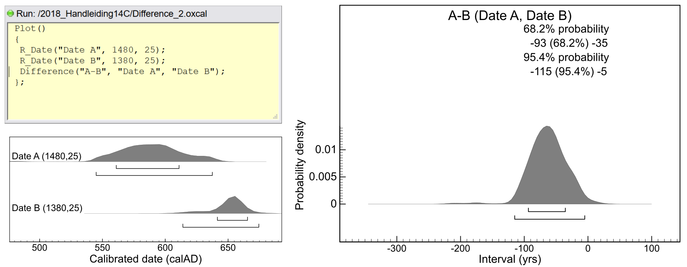

# (PART\*) BIJLAGE II: OxCal {-}

# **Handleiding OxCal** {-#Oxcal}


# Inleiding {-#OxCal_intro}

Van zodra je de resultaten van het radiokoolstoflabo in handen hebt, kan je er zelf mee aan de slag. De conventionele radiokoolstofdateringen kan je dan kalibreren (en – wat handig is – vroegere dateringen opnieuw kalibreren) en de resultaten op een voor jou logische, geordende en visueel aantrekkelijke manier voorstellen in een grafiek. Bijkomende inzichten uit het archeologisch onderzoek, de geregistreerde stratigrafie of relevante historische bronnen laten bovendien toe de resultaten verder te verfijnen of te groeperen, en zogenaamde Bayesiaanse analyses uit te voeren (zie Handleiding, [hoofdstuk 7](#modelleren)). Deze aanpak vraagt enig inzicht in de materie, de context van het onderzochte staal en hulp van gespecialiseerde software die dergelijke berekeningen kan uitvoeren. De kalibratie van radiokoolstofmetingen vraagt immers complexe wiskundige bewerkingen. Het meest uitgebreide en tevens meest populaire softwarepakket dat hiervoor wordt gebruikt is [OxCal](https://c14.arch.ox.ac.uk/oxcal.html), het kalibratieprogramma ontwikkeld door C. Bronk Ramsey van de Oxford Radiocarbon Accelerator Unit (Bronk Ramsey 1995, 2001, 2009). Het volledige softwarepakket is online vrij te gebruiken. Naast de mogelijkheid om radiokoolstofdateringen te kalibreren, laat het ook toe de dateringen met Bayesiaanse modellen te analyseren.

Er zijn uiteraard nog een aantal andere alternatieven, die eveneens vrij te downloaden zijn:

  - CALIB, online en te downloaden pakket, ontwikkeld door M. Stuiver, P.J. Reimer, & R.W. Reimer: [http://calib.org/calib/] 
  - CalPal, de ‘Cologne radiocarbon calibration & paleoclimate research package’: [http://www.calpal-online.de/]
  - BCal, een kalibratieprogramma van de University of Sheffield: [http://bcal.shef.ac.uk/]
  - Bchron, een kalibratieprogramma als R-package: [https://cran.r-project.org/web/packages/Bchron/vignettes/Bchron.html]. ‘R’ is een statistische programmeertaal. 
  - rCarbon, is eveneens een R-package, met functies of radiokoolstofdateringen te kalibreren, modelleren en gesommeerde probabiliteiten te analyseren: [https://cran.r-project.org/web/packages/rcarbon/vignettes/rcarbon.html]

**OxCal** blinkt echter uit in veelzijdigheid. De analyses die het pakket kan uitvoeren kunnen grofweg onderverdeeld worden in twee groepen:

  - Het kalibreren van radiokoolstofmetingen
  - Het analyseren van groepen van radiokoolstofanalyses, rekening houdend met hun onderlinge samenhang, op basis van chronologische of stratigrafische informatie.

Beide types van analyse worden in onderstaande handleiding behandeld en geïllustreerd met een aantal voorbeelden . Alle behandelde functies en uitgewerkte voorbeelden in deze handleiding voor OxCal zijn gebaseerd op versie 4.3 [build 114, 14/08/2018]. Een meer uitgebreide handleiding voor dit programma is te vinden via de online manual: http://c14.arch.ox.ac.uk/oxcalhelp/hlp_contents.html. Daarin worden ook meer geavanceerde toepassingen behandeld, die niet in deze handleiding zijn opgenomen.

Het programma OxCal is toegankelijk via de website https://c14.arch.ox.ac.uk/oxcal/ en kan je kosteloos gebruiken. Wie deze link volgt, krijg steeds toegang tot de meest stabiele en meest recente versie van het programma. Bij het eerste gebruik moet je een persoonlijke account aanmaken, waarmee je daarna kan inloggen (figuur \@ref(fig:oxcal-01)), nieuwe projecten aanmaken en je reeds eerder uitgevoerde en bewaarde analyses opnieuw oproepen.

```{r oxcal-01, fig.cap='Inlogscherm voor OxCal op https://c14.arch.ox.ac.uk/login.', echo = FALSE, out.width='60%', fig.asp=.75, fig.align='center'}

knitr::include_graphics("./figuren/figuur_B_01.jpg")

```

Je kan OxCal ook lokaal installeren op je PC/laptop. Volg hiervoor de instructies op https://c14.arch.ox.ac.uk/oxcal.html#program. Regelmatig de software updaten naar de meest recente versie blijft dan wel nodig. De online versie is daarentegen steeds up-to-date.


# Kalibreren {-}

De meest gebruikte analyse binnen OxCal is het kalibreren van radiokoolstofdateringen. Daarbij wordt een conventionele radiokoolstofdatering, gerapporteerd in jaren BP, omgerekend naar kalenderjaren (BC of AD).

## Kalibratie van één datering {-}

Bij het opstarten van OxCal krijgen we het openingsscherm te zien dat meteen toelaat om een $\mathrm{^{14}C}$-datering te kalibreren (linksboven op figuur \@ref(fig:oxcal-02)).

```{r oxcal-02, fig.cap='Openingsscherm van OxCal. Linksboven kan je een individuele radiokoolstofdatering invoeren en kalibreren.', echo = FALSE, out.width='80%', fig.asp=.75, fig.align='center'}

knitr::include_graphics("./figuren/figuur_B_02.jpg")

```

Volgende velden vragen om input:

  - **Name**: in dit veld wordt bij voorkeur de unieke code van de radiokoolstofanalyse, inclusief de afkorting van het labo dat de analyse uitvoerde, ingevuld (bv. RICH-12345, Beta-98765, …)
  - **Date**: hier wordt de conventionele radiokoolstofdatering, in jaren BP ingevuld (bv. 1599)
  - **±**: de standaardafwijking op de radiokoolstofdatering (bv. 29)
  - **Curve**: hier selecteer je de naam van de kalibratiecurve die je wil gebruiken. Doorgaans is dit de meest recente kalibratiecurve, wat nu (dd. september 2020) de IntCal20-kalibratiecurve is [@reimer_intcal20_2020]. Voor de kalibratie van een radiokoolstofdatering uitgevoerd op materiaal uit een marien reservoir moet een andere curve gekozen worden. Ook de oudere kalibratiecurven worden mee geïnstalleerd en zijn te selecteren indien gewenst. Dit kan handig zijn bij de evaluatie van oudere, in het verleden gepubliceerde dateringen.

Door de knop `[Calibrate]` aan te klikken wordt de kalibratie uitgevoerd en het resultaat meteen in een grafiek voorgesteld (figuur \@ref(fig:oxcal-03)).

```{r oxcal-03, fig.cap='Grafische voorstelling van een gekalibreerde radiokoolstofdatering.', echo = FALSE, out.width='80%', fig.asp=.75, fig.align='center'}

knitr::include_graphics("./figuren/figuur_B_03.jpg")

```

De vormgeving van deze grafiek kan je daarna nog aanpassen in het menu [Format] (figuur \@ref(fig:oxcal-04)). Daar kan je op het tabblad Show kiezen welk betrouwbaarheidsinterval (68,2%, 95,4% en/of 99,7%) en wat voor variabelen (mean = gemiddelde, sigma = standaardafwijking, median = mediaan) je wil weergeven. Het bereik van de assen en de zoomfactor kan je eveneens aanpassen naar eigen voorkeur, via het tabblad Adjust of de pijltoetsen `[Zoom]`, `[Centre]` en `[Span]` in de werkbalk boven de grafiek.

```{r oxcal-04, fig.cap='De lay-out van de grafieken kan via het menu [Format] worden aangepast.', echo = FALSE, out.width='80%', fig.asp=.75, fig.align='center'}

knitr::include_graphics("./figuren/figuur_B_04.png")

```


De meest informatieve en belangrijkste elementen van dergelijke grafieken worden in figuur \@ref(fig:oxcal-05) aangeduid en hieronder kort toegelicht:

  - 1: de kalibratiecurve.
  - 2: het unieke label voor de radiokoolstofdatering, de datering in jaren BP en de standaardafwijking op deze ouderdomsbepaling.
  - 3: op de staande as de normaalverdeling bepaald door de conventionele radiokoolstofdatering, in dit geval 1599 BP als gemiddelde en de daarbij horende standaardafwijking (hier 29 jaar).
  - 4: de gekalibreerde ouderdom in kalenderjaren (AD/BC), met de overeenkomstige waarschijnlijkheidsgrenzen (hier zowel het 1 sigma = 68,2%, als 2-sigma = 95,4% betrouwbaarheidsinterval).
  - 5: op de liggende as de gekalibreerde radiokoolstofdatering met bijhorende waarschijnlijkheidsverdeling.
  - 6: op de liggende as het 1-sigma en 2-sigma betrouwbaarheidsinterval van de gekalibreerde datering.
  - 7: de versie en bijhorende bibliografische referentie van de gebruikte software (OxCal 4.3), en de gebruikte kalibratiecurve (IntCal13).

```{r oxcal-05, fig.cap='Onderdelen van een grafiek met een gekalibreerde radiokoolstofdatering.', echo = FALSE, out.width='80%', fig.asp=.75, fig.align='center'}

knitr::include_graphics("./figuren/figuur_B_05.png")

```


Onder het invulmenu van het openingsscherm (figuur \@ref(fig:oxcal-02)) zijn nog twee andere functies beschikbaar:

  - Met `[View curve]` krijg je de kalibratiecurve te zien. Door de linker muisknop ingedrukt te houden terwijl je over de grafiek beweegt kan je de curve naar de gewenste tijdsperiode schuiven. Door tegelijkertijd de SHIFT-knop in te drukken, wordt het bereik aan kalenderjaren groter of kleiner naargelang je de muis naar links/rechts beweegt. Op die manier kan de kalibratiecurve verkend worden en kan een inschatting worden gemaakt van wat een datering voor een bepaalde tijdsperiode kan opleveren (aanwezigheid van plateau’s, wiggles, steil verloop, turbulente periode).

  - De knop `[Projects…]` laat toe om eerder uitgevoerde en bewaarde OxCal-projecten te selecteren en op te roepen. Je kan opgeslagen projecten en figuren ook terugvinden door [File > Manager] te selecteren.


## Kalibratie van meerdere dateringen {-}

Uiteraard kunnen ook meerdere dateringen tegelijkertijd worden gekalibreerd en samen weergegeven in een zogenaamde multiplot. Dit laat toe om de radiokoolstofdateringen te ordenen volgens een chronologisch kader of stratigrafisch verband. De invoer start met het aanmaken van een nieuw project via het menu `[File > new]`. Daarna start het eigenlijke ingeven van de radiokoolstofdateringen via het tabblad `[Insert]` (figuur \@ref(fig:oxcal-06)). Om een radiokoolstofdatering in te voegen, selecteer je in het keuzemenu links bovenaan `R_Date()`. Deze procedure herhaal je voor alle dateringen die je wil kalibreren en aan de grafiek toevoegen.

```{r oxcal-06, fig.cap='Programmeercode om een multiplot op te bouwen.', echo = FALSE, out.width='60%', fig.asp=.75, fig.align='center'}

knitr::include_graphics("./figuren/figuur_B_06.png")

```


Met de eerste vier knoppen in de werkbalk bovenaan (vak 1 in figuur \@ref(fig:oxcal-06)) krijg je telkens een andere weergave van dezelfde programmeercode. De eerste knop geeft het model schematisch weer (zoals tijdens de invoer), de tweede knop keert de volgorde van de ingevoerde radiokoolstofdateringen om, de derde knop laat de programmeercode zien als een lijst en de laatste knop toont deze programmeercode als tekst (figuur \@ref(fig:oxcal-06), onderaan).
De opbouw van de programmeercode voor het kalibreren en weergeven van een radiokoolstofdatering neemt steeds volgende vorm aan:

```{r eval=FALSE}
Plot()
 {
  R_Date("label", radiokoolstofouderdom in BP, standaardafwijking);
 };
```


De functie `R_Date()` heeft dus drie argumenten (het label van de radiokoolstofdatering de radiokoolstofouderdom en de standaardafwijking), die onderling gescheiden worden door een komma. Een regel eindigt steeds op een puntkomma, en een functie waar binnen andere functies worden opgeroepen begint met een `{` en eindigt met `};`. In deze weergave kan je zelf ook regels programmeercode toevoegen door deze in het geopende venster te typen.

Met de knoppen rechts bovenaan (vak 2 in figuur \@ref(fig:oxcal-06)) kan je respectievelijk een blok programmeercode knippen, kopiëren en plakken.

Om OxCal de berekening te laten uitvoeren selecteer je in het menu `[File > Run]` of klik je rechts bovenaan op de blauwe pijltoets `>`. Nadat de berekeningen zijn uitgevoerd, krijg je eerst een tabel te zien. Door in het keuzeveld links bovenaan `[Multiple plot]` te selecteren, worden alle gekalibreerde radiokoolstofdateringen voorgesteld in één grafiek (figuur \@ref(fig:oxcal-07)). Met de pijltoetsen `[Zoom]`, `[Centre]` en `[Span]`  kan je de assen van de figuur aanpassen. Selecteer je `[Single plot]` dan worden de individuele dateringen één voor één in een aparte grafiek voorgesteld. Met de pijltoetsen rechts bovenaan kan je dan door de volledige reeks van gekalibreerde dateringen bladeren.

```{r oxcal-07, fig.cap='Een multiplot met negen gekalibreerde radiokoolstofdateringen.', echo = FALSE, out.width='80%', fig.asp=.75, fig.align='center'}

knitr::include_graphics("./figuren/figuur_B_07.jpg")

```


## Datainvoer via Excel {-}

Indien een lange lijst met radiokoolstofdateringen moet gekalibreerd worden, kan het invoegen in OxCal relatief veel tijd in beslag nemen. Via een omweg kan je in Excel of een gelijkaardig programma met rekenbladen de radiokoolstofdateringen eerst omvormen in programmacode die leesbaar is door OxCal. Start vanuit een tabel waarin de eerste drie kolommen bestaan uit: de `labocode (label)`, `de radiokoolstofouderdom` in BP en `de standaardafwijking`. In de kolommen ernaast voeg je stukken van de door OxCal gestandaardiseerde programmeercode toe (zie figuur \@ref(fig:oxcal-08)). Daarna breng je alle stukken tekst samen - met de Excel-functie `TEKST.SAMENVOEGEN` - in een formaat dat kan gekopieerd worden in OxCal.

```{r oxcal-08, fig.cap='OxCal-programmacode aanmaken in MS Excel voor meerdere radiokoolstofdateringen. Met de functie TEKST.SAMENVOEGEN (1) breng je de stukken tekst uit de verschillende kolommen (2) samen tot de programmacode uit OxCal (3).', echo = FALSE, out.width='80%', fig.asp=.75, fig.align='center'}

knitr::include_graphics("./figuren/figuur_B_08.png")

```


Een nog eenvoudiger alternatief start met het openen van een nieuw project in OxCal. In het Excel bestand kopieer je ondertussen de drie kolommen met de labocode, radiokoolstofouderdom en de standaardafwijking. Via het tabblad `[Tools > Import]` krijg je een venster te zien met drie kolommen: Name, $\mathrm{^{14}C}$ Date en Uncertainty (figuur \@ref(fig:oxcal-09)). In dit venster plak je de gegevens die je uit Excel hebt gekopieerd. Met de knop `[ >> ]` worden deze dateringen dan omgezet en overgebracht in het venster met de programmeercode.

```{r oxcal-09, fig.cap='Copy-paste de gegevens van de radiokoolstofdateringen rechtstreeks in OxCal.', echo = FALSE, out.width='50%', fig.asp=.75, fig.align='center'}

knitr::include_graphics("./figuren/figuur_B_09.jpg")

```


Welke methode er ook wordt gevolgd, door de aangemaakte programmeercode uit te voeren, bekomt men één grafiek met alle radiokoolstofdateringen samen.

## Grafieken en tabellen {-}

Eens een kalibratie uitgevoerd, zijn de resultaten zowel beschikbaar als een grafische voorstelling als in tabelvorm. De grafiek met de kalibratie van individuele radiokoolstofdateringen krijgt men te zien na selectie van `[Single plot]` in het keuzemenu links bovenaan het scherm. Indien meerder dateringen tegelijkertijd werden gekalibreerd, kunnen de individuele grafieken doorlopen worden met behulp van de pijlen rechts bovenaan het scherm. Alle gekalibreerde dateringen tegelijkertijd weergeven kan door de optie `[Multiple plot]` te selecteren in het keuzemenu. In een multiplot worden alle gekalibreerde dateringen onder elkaar weergegeven in de volgorde waarin ze werden ingevoerd. De grootte, het bereik en de periode die wordt overspannen in de grafiek kan je aanpassen in het menu `[Format]` en de tabbladen die in dit menu verschijnen, of met de knoppen bovenaan het venster. In het tabblad Show kan men ook aangeven welk waarschijnlijkheidsinterval (of meerdere) je wil weergegeven in de grafiek.

Opslaan van de grafieken verloopt via het menu `[File > Save as]`. Daarna krijgt je een venster te zien waarin men een mappenstructuur kan opbouwen en in de gewenste map de output onder de vorm van een grafiek opslaan. In de online versie van OxCal kan men de grafieken bewaren op de server, onder de ingelogde account. Bij het opnieuw inloggen kan je via `[File > Manager]` de resultaten opnieuw opvragen. Wil men een lokale kopie van de grafiek, dan selecteert men de knop `[Download]` rechts onderaan, nadat men het gewenste output formaat heeft gekozen: als .pdf (*portable document format*), .png (*portable network grafic*) of .svg (*scalable vector grafic*). De grafiek wordt daarna in het gewenste formaat gedownload.

De output in de vorm van tekst laat zich minder vlot exporteren. In het keuzemenu selecteert je eerst `[Table]`, waarna een tabel verschijnt met alle resultaten. Door in de tweede kolom te klikken, komt een venster tevoorschijn met bovenaan de gekalibreerde dateringen in tekstvorm, voor elk van de gevraagde betrouwbaarheidsintervallen (figuur \@ref(fig:oxcal-10)). Deze numerieke gegevens kan je als tekst kopiëren naar een eigen rapport of tabel. Met de pijltjestoetsen bovenaan rechts doorloop je alle gekalibreerde radiokoolstofdateringen.

```{r oxcal-10, fig.cap='Output in tekstvorm na kalibratie.', echo = FALSE, out.width='80%', fig.asp=.75, fig.align='center'}

knitr::include_graphics("./figuren/figuur_B_10.png")

```


# Een datering simuleren {-}

In veel gevallen heeft men op voorhand wel een idee uit welke periode een object, constructie of gebeurtenis dateert. Indien een radiokoolstofdatering wordt overwogen, kan het nuttig zijn om voorafgaand aan de staalname en analyse de vorm van de kalibratiecurve binnen de geschatte periode te controleren. Indien er veel wiggles aanwezig zijn, zal een radiokoolstofdatering binnen die periode meerdere mogelijkheden of een breed interval aan kalenderjaren opleveren. Ook indien een plateau aanwezig is, zal het bereik aan mogelijke kalenderjaren breed uitvallen (zie 4.6). Zoals al eerder aangegeven, kan je de kalibratiecurve bekijken in OxCal door op de startpagina de knop `[View curve]` aan te klikken. Om dit nog wat verder te exploreren kan je binnen OxCal voor een welbepaalde kalenderdatum een mogelijke radiokoolstofdatering simuleren. Daarvoor moet je na het opstarten van een nieuw project `[File > new]` in het menu `[Insert]` de functie `R_Simulate()` selecteren in de keuzelijst en deze functie met de knop `[ >> ]` naar het venster met programmeercode overbrengen. Uiteraard kan je in deze weergave ook de programeercode zelf intypen (figuur \@ref(fig:oxcal-11)). Als parameters voor deze functie moet je een naam geven aan de simulatie (tussen aanhalingstekens), het jaartal dat je wil simuleren (AD of BC met het jaar tussen haakjes) en de verwachte standaardafwijking op de radiokoolstofdatering.

```{r eval=FALSE}
 Plot()
 {
  R_Simulate("Simulatie 650 AD", AD(650), 30);
 };
```

```{r oxcal-11, fig.cap='Programmacode voor het simuleren van een datering op materiaal uit 650 AD.', echo = FALSE, out.width='80%', fig.asp=.75, fig.align='center'}

knitr::include_graphics("./figuren/figuur_B_11.png")

```

Als resultaat krijg je een radiokoolstofdatering gesimuleerd (in dit voorbeeld 1404 ±30 BP) die kan overeenstemmen met een gebeurtenis op de ingevoerde kalenderdatum. Telkens deze analyse opnieuw wordt uitgevoerd, krijgen we een andere mogelijke radiokoolstofdatering gesimuleerd. Je kan voor één kalenderjaar dus best meerdere simulaties uitvoeren om zo een goed beeld te krijgen van de mogelijke resultaten.

# Dateringen combineren {-}

Indien er voor eenzelfde gebeurtenis meerdere radiokoolstofdateringen beschikbaar zijn, kunnen deze voorafgaand aan de kalibratie samengevoegd worden. Op deze manier tracht men de nauwkeurigheid op de datering van deze gebeurtenis te verhogen door meerdere informatiebronnen te combineren. Het kan bijvoorbeeld interessant zijn als uit één graf zowel de kledij (textielresten), een stuk botmateriaal van een individu, alsook een stuk spinthout uit één van de planken van de doodskist zijn gedateerd. Indien we aannemen dat de kist en de kledij kort voor het overlijden van die persoon gemaakt zijn, kan de combinatie van al deze dateringen de sterfdatum beter benaderen dan de individuele dateringen. Andere voorbeelden zijn het combineren van de dateringen op meerdere dierlijke botfragmenten uit eenzelfde afvalcontext, of het uitvoeren van meerdere dateringen op eenzelfde mensenskelet. Het combineren van dateringen kan voor of na de eigenlijke kalibratie.


## R_Combine {-}

Meerdere radiokoolstofdateringen van stalen die dezelfde gebeurtenis of object dateren en die opgebouwd zijn met koolstof uit eenzelfde reservoir, kunnen beschouwd worden als herhaalde metingen. Deze herhaalde metingen kunnen dan gecombineerd worden. Dit zal een meer robuust dateringsresultaat opleveren: het zijn immers dateringen van eenzelfde gebeurtenis. De datering van meerdere beenderen van eenzelfde skelet vallen bijvoorbeeld onder deze categorie. Ze dateren alle het overlijden van dezelfde persoon en het koolstofreservoir (de voeding) is ook identiek. In dit geval kunnen de radiokoolstofdateringen samen gevoegd worden voorafgaand aan de eigenlijke kalibratie, door gebruik te maken van de functie `R_Combine()`.

Dit voer je uit door, na het opstarten van een nieuw project `[File > new]`, in het menu `[Insert]` `R_Combine()` te selecteren in de bovenste keuzelijst, en dit via de knop `[ >> ]` naar het venster met de programmacode over te brengen. Daarna selecteer je `R_Date()` en vul je alle parameters in (Name, 14C Date en Uncertainty) voor de eerste radiokoolstofdatering. Met de knop `[ >> ]` wordt deze datering toegevoegd aan het rechter venster. Deze stappen worden herhaald met alle te combineren dateringen. Na het uitvoeren van dit model, via het menu `[File > Run]`, en de daarbij horende kalibratie zal de gecombineerde datering meestal een nauwer resultaat geven in vergelijking met de individuele dateringen.

Tijdens het combineren van de radiokoolstofdateringen voert OxCal ook een statistische test uit om na te gaan of de individuele dateringen weldegelijk een benadering van dezelfde gebeurtenis kunnen zijn. Dit is een $\chi^2$-test (Chi-kwadraat-test) waarvan het resultaat in de grafiek wordt weergegeven. In deze test wordt een T-waarde berekend, die kleiner moet zijn dan de kritische *t*-waarde voor het beoogde betrouwbaarheidsinterval en het aantal dateringen die gecombineerd worden. Indien de T-waarde toch groter is dan deze kritische waarde (weergegeven tussen haakjes in de grafiek), mogen de radiokoolstofdateringen niet worden samen gevoegd en moeten ze afzonderlijk gerapporteerd worden. Indien de T-waarde lager ligt dan deze drempelwaarde, kunnen we met 95% zekerheid stellen dat de individuele dateringen inderdaad eenzelfde gebeurtenis kunnen vertegenwoordigen.


## Combine {-}

Indien meerdere radiokoolstofanalyses een zelfde gebeurtenis dateren, maar de geanalyseerde stalen niet hetzelfde koolstofreservoir hebben aangesproken, kunnen deze pas na kalibratie samengevoegd worden. De overeenkomst tussen de dateringen kan nu niet met een $\chi^2$-test worden getoetst, maar wordt aan de hand van een *Agreement index* geëvalueerd. Deze index $A$ geeft weer of de gecombineerde radiokoolstofdateringen daadwerkelijk eenzelfde gebeurtenis dateren. De $A_{comb}$ moet groter zijn dan de kritische $A_n$-waarde en best rond de 100% liggen. In onderstaand voorbeeld (figuur \@ref(fig:oxcal-12)) worden drie dateringen op materiaal uit een zelfde grafkist gecombineerd. De $A_{comb}$ (113,6%) ligt in dit geval hoger dan de drempelwaarde ($A_n$ = 40,8%). De drie dateringen kunnen dus inderdaad een zelfde gebeurtenis dateren. De combinatie van deze dateringen geeft een nauwer dateringsinterval dan de individuele radiokoolstofdateringen (Grafkist2: 544AD (95.4%) 600AD).

```{r eval=FALSE}
 Plot()
 {
  Combine("Grafkist2")
  {
   R_Date("Grafkist_bot", 1475, 25);
   R_Date("Grafkist_textiel", 1500, 30);
   R_Date("Grafkist_hout", 1530, 30);
  };
 };

```

```{r oxcal-12, fig.cap='Combineren van drie dateringen na kalibratie.', echo = FALSE, out.width='80%', fig.asp=.75, fig.align='center'}

knitr::include_graphics("./figuren/figuur_B_12.png")

```


Om volledig correct te zijn, moet er op gewezen worden dat er bij de interpretatie van gecombineerde dateringen nooit 100% zekerheid is dat de dateringen echt gelijktijdig zijn, of zelfs als één gebeurtenis kunnen bestempeld worden. Zelfs bij een gunstige waarde voor de *Agreement index* is er geen statistische grond om te besluiten dat ze volledig gelijktijdig zijn. In het voorbeeld van de begraving zijn het scheren van de wol voor de productie van een stuk textiel, het overlijden van de persoon en het kappen van een boom voor het hout van de kist drie aparte gebeurtenissen, die niet op hetzelfde moment doorgingen maar wel in de tijd dichtbij elkaar kunnen liggen. Bij het uitvoeren van meerdere dateringen op één skelet gaat het natuurlijk wel om één gebeurtenis. Bij het dateren van meerdere skeletten uit één grafkamer liggen alle mogelijkheden open.


## Difference {-}

Het combineren van dateringen wordt niet alleen gebruikt om een verfijnde datering te bekomen bij vermoeden van quasi gelijktijdigheid, maar deze procedure kan ook helpen bewijzen dat bepaalde vondsten helemaal niet uit dezelfde periode dateren. Zo kan bijvoorbeeld residueel en intrusief materiaal als dusdanig herkend worden. Indien er een sterk vermoeden is dat twee dateringen niet een zelfde gebeurtenis dateren – de$\chi^2$-test of *Agreement index* valt boven of onder de kritische drempelwaarde – kan bovendien becijferd worden hoe ver beide gebeurtenissen mogelijk uit elkaar liggen. In OxCal voert de functie `Difference()` daarvoor de nodige bewerkingen uit.

```{r eval=FALSE}
 {
  Phase("Mogelijk gelijktijdig?")
  {
   R_Date("Date A", 1480, 25);
   R_Date("Date B", 1380, 25);
  };
  Difference("A-B", "Date A", "Date B");
 };

```

```{r oxcal-13, fig.cap='Opbouwen van een waarschijnlijkheidsverdeling voor het verschil tussen twee radiokoolstofdateringen. We kunnen met 95,4% zekerheid stellen dat er minstens 5 tot maximaal 115 kalenderjaren tussen beide gedateerde gebeurtenissen ligt. Deze radiokoolstofdateringen kunnen niet een zelfde gebeurtenis dateren.', echo = FALSE, out.width='80%', fig.asp=.75, fig.align='center'}



```


Bij de opbouw van het model dat het verschil tussen twee dateringen berekent, gebruikt je het label of de naam die je aan de individuele dateringen hebt gegeven. In de functie `Difference()` specifieer je dan met welke twee dateringen je wil werken:

```{r eval=FALSE}

Difference (“verschil”, “eerste datering”, “tweede datering”)

```

De grafiek die hiermee wordt opgebouwd laat de waarschijnlijkheidsverdeling zien van het mogelijke tijdsinterval tussen de twee dateringen. Indien een verschil (Interval) van 0 jaar binnen het 95,4% interval ligt, dan zijn we niet zeker dat er werkelijk een verschil zit tussen de dateringen. In het voorbeeld in figuur \@ref(fig:oxcal-13) ligt 0 buiten het 95,4% betrouwbaarheidsinterval, waarvan boven- en ondergrens aangeven dat datering A minstens 5 en maximaal 115 kalenderjaren ouder is dan datering B.


# Densiteitsplot {-}

Indien uit een bepaalde context, periode of regio veel radiokoolstofdateringen van een zelfde cultureel of natuurlijk fenomeen beschikbaar zijn, kan de som van hun probabiliteiten (waarschijnlijkheidsverdeling) een duidelijker beeld geven van de chronologische spreiding en van het voorkomen van hiaten in dit fenomeen doorheen de tijd. In OxCal kan de som van meerdere radiokoolstofdateringen berekend worden met de functie `Sum()`. Een dergelijk model bouw je op via het menu `[Insert]` waarna je in het keuzemenu deze functie selecteert en overbrengt naar het venster met de programmacode. Daarna voeg je de individuele radiokoolstofdateringen toe met de functie `R_Date()`.

In onderstaand voorbeeld – met dateringen van stukjes houtskool uit verschillende houtskoolmeilers – wordt duidelijk dat er in een dataset met 69 radiokoolstofdateringen uit eenzelfde regio en periode een duidelijk hiaat aanwezig is in houtskoolproductie tussen ca. 400 en 650 AD (figuur \@ref(fig:oxcal-14)).

```{r oxcal-14, fig.cap='De probabiliteitssom van 69 individuele radiokoolstofdateringen.', echo = FALSE, out.width='100%', fig.asp=.75, fig.align='center'}

knitr::include_graphics("./figuren/figuur_B_14.png")

```


Uit kritische evaluaties van deze methode blijkt echter dat de gesommeerde probabiliteiten met de nodige voorzichtigheid moeten geïnterpreteerd worden [@contreras_summed_2014; @steele_radiocarbon_2010; @williams_use_2012]. De vorm van de kalibratiecurve heeft immers een duidelijke invloed op het eindresultaat en uit de analyses blijkt dat er heel veel radiokoolstofdateringen nodig zijn om tot een stabiel resultaat te komen. De uiteindelijke waarschijnlijkheden (*probability density*) mogen ook niet als absolute waarden geïnterpreteerd worden.


# Fasering en chronologie {-}

Het in kaart brengen van de onderlinge samenhang en opeenvolging van individuele radiokoolstofdateringen, kan tot een meer gedetailleerde interpretatie en nauwere datering van gebeurtenissen leiden. Bij archeologisch onderzoek wordt deze informatie uit de stratigrafie van de onderzochte site afgeleid. Deze stratigrafie kan schematisch in beeld gebracht worden door een matrix op te bouwen – de zogenaamde Harris-matrix [@harris_principles_1989] – waardoor bij een uitgekiende selectie van stalen ook het onderlinge verband tussen de individuele radiokoolstofdateringen formeel wordt vastgelegd. Ook tijdens het onderzoek van bouwkundig erfgoed kan het herkennen van verschillende bouwfases, en het in rekening brengen van historische bronnen zoals een gearchiveerd contract, de uitgevoerde radiokoolstofdateringen verder verfijnen. Stratigrafische en chronologische verbanden kunnen mee opgenomen worden in een Bayesiaans model (zie [hoofdstuk 7](#modelleren)), waar deze informatie ook een mathematische betekenis krijgt en de radiokoolstofdateringen binnen dit kader inpast. In wat volgt wordt de opbouw van een Bayesiaans model in OxCal geïllustreerd met een aantal voorbeelden.


## Modelopbouw {-}

De twee meest voorkomende begrippen die van belang zijn bij de opbouw van een Bayesiaans model dat stratigrafie en/of chronologische fasering in rekening brengt, zijn **fasen** en **sequenties**. De definities uit de Handleiding (zie 7.3) worden hier hernomen:

  - **Fase**: verzameling van gebeurtenissen die samen een coherente, contextuele groep vormen, zonder informatie over de interne chronologische ordening (bv. dateringen uit een zelfde archeologische laag).
  - **Sequentie**: verzameling van gebeurtenissen die samen een coherente, contextuele groep vormen waarbij de onderlinge chronologische volgorde gekend is (bv. dateringen uit een stratigrafische gelaagdheid).

In OxCal kunnen beide begrippen gebruikt worden, en onderling gecombineerd, via de functies `Sequence()` en `Phase()`. Binnen een fase worden alle radiokoolstofdateringen opgenomen, met de functie `R_Date()`, die tot eenzelfde archeologische laag, periode of gebeurtenis behoren. Binnen een fase is er geen chronologische volgorde van de gedateerde stalen. Bij een sequentie is de opeenvolging van de verschillende dateringen wel gekend, en worden ze gerangschikt van oud (bovenaan) naar jong (onderaan). Deze volgorde volgt bijvoorbeeld uit de stratigrafische ligging van de gedateerde stalen, waarbij de oudere stalen steeds onder lagen van jonger materiaal werden aangetroffen.

Beide groeperingen kunnen door elkaar worden gebruikt. Zo kunnen er binnen één sequentie meerdere fasen aanwezig zijn, waarbij de fasen onderling in stratigrafisch verband te brengen zijn, maar er binnen de verschillende fasen geen chronologische ordening kan vooropgesteld worden. Door deze informatie (voorafgaand) in het model in te brengen, kan het dateringsinterval op de individuele gekalibreerde dateringen nauwer berekend worden. In onderstaand voorbeeld worden vier gedateerde stalen uit boven elkaar liggende archeologische lagen in een sequentie gemodelleerd (figuur \@ref(fig:oxcal-15)). Na modellering zijn de originele gekalibreerde dateringen (in grijs) terug te brengen tot een nauwere waarschijnlijkheidsverdeling (donker grijs) – en dus enger tijdsinterval – doordat rekening is gehouden met de onderlinge samenhang van de individuele dateringen.


```{r eval=FALSE}
 Plot()
 {
  Sequence("Gesimuleerde sequentie")
  {
    R_Date("sim1", 3200, 25);
    R_Date("sim2", 3180, 20);
    R_Date("sim3", 3160, 20);
    R_Date("sim4", 3150, 20);
  };
 };

```

```{r oxcal-15, fig.cap=' Bayesiaans model met vier radiokoolstofdateringen die chronologisch kunnen geordend worden op basis van de stratigrafie.', echo = FALSE, out.width='80%', fig.asp=.75, fig.align='center'}

knitr::include_graphics("./figuren/figuur_B_15.png")

```


De radiokoolstofdateringen die beschikbaar zijn voor één bepaalde sequentie of fase geven niet noodzakelijk een goede afbakening voor het begin en einde van die fase. Hoe minder gedateerde elementen uit een bepaalde fase, of uit de vroegste fase van een sequentie, hoe minder waarschijnlijk het is dat de oudste datering effectief het oudste element is uit die fase, waardoor je minder zeker bent van de datering van de aanvang van die fase, en van de eventuele sequentie. Hetzelfde geldt – omgekeerd – voor het eind van een fase of een sequentie. OxCal tracht daaraan tegemoet te komen door van de veronderstelling uit te gaan dat de gedateerde stalen een gelijke (uniforme) kans hebben om uit het begin, midden of einde van de fase te dateren. Een uniforme kansverdeling betekent dat de gedateerde materialen beschouwd worden als een willekeurige staalname uit de fase die men wil dateren: ze hebben elk dus evenveel kans op voorkomen op elk mogelijk tijdstip binnen de afgebakende fase. Dit kan in het model ingevoerd door grenzen – boundaries – te definiëren en zo verschillende groepen af te bakenen. De boundaries zullen er rekening mee houden dat de gedateerde stalen waarschijnlijk slechts in beperkte mate de volledige fase overspannen. Hoe groter de steekproef uit één fase, m.a.w. hoe groter het aantal gedateerde stalen, hoe scherper en met meer zekerheid de grenzen van die fase kunnen afgebakend worden.

In het geval dat verschillende fasen elkaar mooi opvolgen, kan er één sequentie gedefinieerd worden waarbinnen de opeenvolgende fasen worden opgenomen (figuur \@ref(fig:oxcal-16)). De boundaries geven dan aan waar de overgang tussen het einde van de ene en het begin van de daaropvolgende fase te situeren is. Na kalibratie bekomt men zo een nauwere datering voor de individuele dateringen. Deze gemodelleerde kalibratie van de radiokoolstofouderdom wordt steeds in donkere tinten weergegeven, terwijl de oorspronkelijke waarschijnlijkheidsverdeling in lichte grijstinten is aangeduid.

```{r eval=FALSE}
 Plot()
 {
  Sequence(" > elkaar opeenvolgende lagen")
  {
   Boundary(" start fase 1");
   Phase(" materiaal uit laag A")
   {
    R_Date("A1", 3675, 34);
    R_Date("A2", 3670, 40);
    R_Date("A3", 3600, 35);
   };
   Boundary(" einde fase 1 / begin fase 2");
   Phase(" materiaal uit laag B")
   {
    R_Date("B1", 3420, 45);
    R_Date("B2", 3370, 35);
    R_Date("B3", 3435, 40);
    R_date("B4", 3304, 55);
    R_date("B5", 3184, 55);
   };
   Boundary(" einde fase 2 / begin fase 3");
   Phase(" materiaal uit laag E")
   {
    R_Date("E1", 3140, 45);
    R_Date("E2", 3070, 30);
    R_Date("E3", 3005, 30);
   };
   Boundary(" einde fase 3");
  };
 };
```

```{r oxcal-16, fig.cap=' Bayesiaans model met vier radiokoolstofdateringen die chronologisch kunnen geordend worden op basis van de stratigrafie.', echo = FALSE, out.width='80%', fig.asp=.75, fig.align='center'}

knitr::include_graphics("./figuren/figuur_B_16.png")

```


Is er daarentegen een overlap mogelijk tussen de verschillende fases (volgende fase vangt aan voor het einde van een voorafgaande fase), dan worden verschillende fasen gedefinieerd binnen één globale fase. De boundaries bepalen dan simpelweg voor elke groep apart het begin en het einde. Het einde van een bepaalde fase kan dan een grote overlap vertonen met de ingeschatte aanvang van een andere fase (figuur \@ref(fig:oxcal-17)).

```{r eval=FALSE}
 Plot()
 {
  Phase(" > elkaar overlappende fasen")
  {
   Sequence()
   {
    Boundary(" start fase 1");
    Phase(" materiaal uit laag A")
    {
     R_Date("A1", 3675, 34);
     R_Date("A2", 3670, 40);
     R_Date("A3", 3600, 35);
    };
    Boundary(" einde fase 1");
   };
   Sequence()
   {
    Boundary(" start fase 2");
    Phase(" materiaal uit laag B")
    {
     R_Date("B1", 3420, 45);
     R_Date("B2", 3370, 35);
     R_Date("B3", 3435, 40);
     R_date("B4", 3304, 55);
     R_date("B5", 3184, 55);
    };
    Boundary(" einde fase 2");
   };
   Sequence()
   {
    Boundary(" start fase 3");
    Phase(" materiaal uit laag E")
    {
     R_Date("E1", 3140, 45);
     R_Date("E2", 3070, 30);
     R_Date("E3", 3005, 30);
    };
    Boundary(" einde fase 3");
   };
  };
 };

```

```{r oxcal-17, fig.cap=' Modellering van radiokoolstofdateringen uit drie elkaar mogelijk overlappende fases, gedateerd met materiaal uit drie lagen die onderling geen duidelijk stratigrafisch verband hebben.', echo = FALSE, out.width='80%', fig.asp=.75, fig.align='center'}

knitr::include_graphics("./figuren/figuur_B_17.png")

```


Uit bovenstaande voorbeelden blijkt eveneens dat indien er maar een beperkt aantal dateringen beschikbaar is binnen één fase het eveneens moeilijker wordt (er is een grotere onzekerheid) om het begin en eindpunt van een fase af te bakenen. Dat uit zich in het grotere betrouwbaarheidsinterval op de boundaries (begin en einde).

## Historische datum of gebeurtenis {-}

Naast de `R_Date()` functie, om radiokoolstofdateringen te kalibreren, kan OxCal ook andere vormen van dateringsinformatie verwerken. Een historische datum of dendrochronologische datering kan eveneens ingevoerd worden, samen met de radiokoolstofdateringen. Ook de onzekerheid, uitgedrukt in kalenderjaren, op een historische gebeurtenis of de spreiding op een dendrochronologische datering kunnen mee in rekening gebracht worden. Volgende functies komen hiervoor in aanmerking:

  - `C_Date(“Label”, kalenderjaar, onzekerheid)`: definieert een kalenderjaar. Het kalenderjaar wordt als AD(1302) of BC(1000) ingevuld, de (mogelijke) onzekerheid op deze datum wordt uitgedrukt in kalenderjaren. Deze kan ook 0 zijn in geval het een historische datum betreft.
  - `Date(“Label”, U(begin, einde))`: uniforme verdeling tussen een bepaalde begin- en einddatum, bijvoorbeeld 1300 tot en met 1400 voor de 14de eeuw AD. De parameters voor boven- en ondergrens worden als kalenderjaren AD (jaar) of BC (jaar) ingevuld.
  - `Before(“Label”, expressie)`: definieert een _terminus ante quem_.
  - `After(“Label”, expressie)`: definieert een _terminus post quem_.
  

```{r eval= FALSE}
 Plot()
 {
  C_Date("Guldensporen", 1302);
  C_Date("Rond 1300 AD", AD(1300), 10) {color="Darkblue";};
  Date("Van 1290 tot 1340", U(1290, 1340)) {color="Red";};
  R_Date(" 600 ±25BP ", 600, 25) &
      Before(" gekende terminus", AD(1350));
 };
```

```{r oxcal-18, fig.cap='OxCal functies om een gekende datering in te voegen of te combineren.', echo = FALSE, out.width='100%', fig.asp=.75, fig.align='center'}

knitr::include_graphics("./figuren/figuur_B_18.png")

```


Met `C_Date()` kan een kalenderjaar ingevoerd worden. Indien er enige onzekerheid met deze datum geassocieerd is, kan deze mee opgenomen worden. Er wordt dan een normaalverdeling geplot met het kalenderjaar als gemiddelde en de onzekerheid op deze datum als standaardafwijking. 

De functie `Date()` laat toe om een bepaalde tijdsrange of periode af te bakenen. De kansverdeling binnen dit interval wordt doorgaans als uniform gedefinieerd, waardoor alle kalenderjaren binnen het gedefinieerde interval evenveel kans op voorkomen hebben.

Indien een historische datum is gekend waarna een bepaalde gebeurtenis onmogelijk kan vallen, dan kan dit in rekening worden gebracht bij de kalibratie van een radiokoolstofdatering die geassocieerd is met die gebeurtenis. Door gebruik te maken van het commando `Before()` en dit met het symbool & te koppelen aan een radiokoolstofdatering. Na het berekenen van dit model zal het bereik (en kansverdeling) van mogelijke kalenderjaren worden beperkt tot deze grenswaarde (figuur \@ref(fig:oxcal-18)). Een terminus ante quem kan op vergelijkbare wijze worden ingevoerd met de syntax `After()`.

Een combinatie van bovenstaande functies kan nu aangewend worden om een reëel vraagstuk te modelleren, zoals te zien in figuur \@ref(fig:oxcal-19).

```{r eval=FALSE}
 Plot()
 {
  Sequence(": Ename 974?")
  {
   C_Date(": Stichting", AD(974), 0);
   Boundary("start");
   Phase(": voor donjon")
   {
    R_Date(": onderste laag", 1090, 25);
    R_Date(": bovenste laag", 1095, 30);
    R_Date(": buiten omwalling", 1110, 25);
   };
   Phase(": aanleg")
   {
    R_Date(": paal", 1045, 35);
   };
   Phase(": depressie")
   {
    R_Date(": onderste laag", 1020, 35);
    R_Date(": middelste laag", 1045, 30);
    R_Date(": bovenste laag", 1040, 45);
   };
   Boundary("end");
  };
 };

```

```{r oxcal-19, fig.cap='Een Bayesiaans model voor radiokoolstofdateringen in stratigrafisch verband, rekening houdend met een historische bron.', echo = FALSE, out.width='80%', fig.asp=.75, fig.align='center'}

knitr::include_graphics("./figuren/figuur_B_19.png")

```

Na het berekenen van dit model `[File > Run]`, krijgen we een grafisch overzicht van het resultaat in een multiplot. Door de opgelegde voorwaarden – historische bron als oudst mogelijke datering en afbakening van verschillende elkaar opvolgende fasen – worden de mogelijke gekalibreerde dateringen voor de individuele radiokoolstofdateringen sterk ingeperkt.


## Hoe lang? {-}

De opbouw van een Bayesiaans model en het gebruik van boundaries laat toe om ook gebeurtenissen te dateren die niet rechtstreeks aan één staal of radiokoolstofdatering te koppelen zijn. Door het indelen in fasen en sequenties kunnen we namelijk ook berekenen hoe lang een bepaalde fase heeft geduurd, wanneer die op z’n einde liep of welke periode nu precies door de radiokoolstofdateringen wordt overspannen. De twee functies die daarvoor kunnen aangesproken worden in OxCal zijn `Interval()` en `Span()`. Elk van deze functies berekent een waarschijnlijkheidsverdeling voor de duur van de periode (figuur \@ref(fig:oxcal-20)).

De functie **`Span()`** berekent de periode die door alle dateringen binnen een fase of sequentie wordt overspannen. Er wordt hierbij enkel rekening gehouden met de individuele radiokoolstofdateringen. De boundaries van de fase of sequentie worden hierbij niet in rekening gebracht. Dat is echter wel zo bij de functie **`Interval()`** die de waarschijnlijkheidsverdeling voor de lengte van het interval tussen het begin en einde van een fase berekent. Deze functie houdt er dus rekening mee dat de aanvang en het einde van een fase niet noodzakelijk gedateerd wordt door één van de geanalyseerde stalen.

```{r eval=FALSE}
 Plot()
 {
Sequence()
    {
     Boundary("Start fase");
     Phase()
     {
      R_Date("A",2235,25);
      R_Date("B",2135,26);
      R_Date("C",2112,23);
      R_Date("D",2000,23);

     };
      Interval();
      Span();
     Boundary("Einde fase");
    };
 };
```

```{r oxcal-20, fig.cap='Berekening van de periode die wordt overspannen door de radiokoolstofdateringen (Span) en de geschatte duur van de fase (Interval).', echo = FALSE, out.width='100%', fig.asp=.75, fig.align='center'}

knitr::include_graphics("./figuren/figuur_B_20.png")

```


## Kwaliteitscontrole en evaluatie {-}

OxCal enkel de kalibraties en berekeningen laten uitvoeren is niet voldoende; een kritische evaluatie van de resultaten en het opgebouwde model blijven noodzakelijk. Door in het keuzemenu links bovenaan [Table] te selecteren krijg je in een tabel meer details over de kwaliteit van het opgebouwde model en de gemodelleerde dateringen (figuur \@ref(fig:oxcal-21)). Dit wordt uitgedrukt in een _Agreement index_ ($A$). Deze index dient hoger te zijn dan 60%, zowel bij de individuele dateringen als bij het globale model ($A_{model}$), en moet idealiter rond de 100% liggen. Indien de Agreement voor het volledige model te laag uitvalt, krijg je een melding die er als volgt uitziet:

```{r eval=FALSE, class.output="bg-danger" }

Warning! Poor agreement - A=58.1% (A’c=60.0%)

```

Voor het model in figuur \@ref(fig:oxcal-19) is de $A$-index 133,1% voor het globale model (rode kader bovenaan figuur \@ref(fig:oxcal-21)), wat betekent dat de opgebouwde sequentie stand houdt. Enkel bij de datering van het staal dat buiten de omwalling werd gevonden worden vraagtekens geplaatst aangezien deze datering niet zo goed in het hier gedefinieerde model past (kolom A in figuur \@ref(fig:oxcal-21)). De $A$-index is voor deze datering dan ook lager dan 60%. Indien er afwijkende dateringen in het model voorkomen, is het altijd aangeraden het eens te herberekenen zonder deze outliers. Hun aanwezigheid beïnvloedt immers de aanpassingen op de probabiliteitsverdelingen van de ‘passende’ dateringen.

```{r oxcal-21, fig.cap='Output met de evaluatie van het opgebouwde Bayesiaanse model, in tabelvorm.', echo = FALSE, out.width='100%', fig.asp=.75, fig.align='center'}

knitr::include_graphics("./figuren/figuur_B_21.png")

```


Door in de keuzelijst [single plot] te kiezen kan je de individuele dateringen, en hun gemodelleerde kansverdeling, bekijken. Voor de gedateerde funderingspaal is het gekalibreerde dateringsinterval (95,4% betrouwbaarheid) volgens dit model te situeren tussen 978 en 1009 AD (figuur \@ref(fig:oxcal-22)). Deze bouwfase laat zich – mede op historische grond – vermoedelijk rond het jaar 1000 AD situeren.

```{r oxcal-22, fig.cap='Gemodelleerde datering van een individueel element uit het opgebouwde Bayesiaans model.', echo = FALSE, out.width='60%', fig.asp=.75, fig.align='center'}

knitr::include_graphics("./figuren/figuur_B_22.png")

```


De mogelijkheid tot modelleren leidt tot de conclusie dat, indien een aantal dateringen wordt uitgevoerd om een beeld te krijgen van de chronologische spreiding van vondsten uit een ensemble, het een voordeel kan zijn om vondsten te nemen die onderling een duidelijk stratigrafisch verband hebben.
