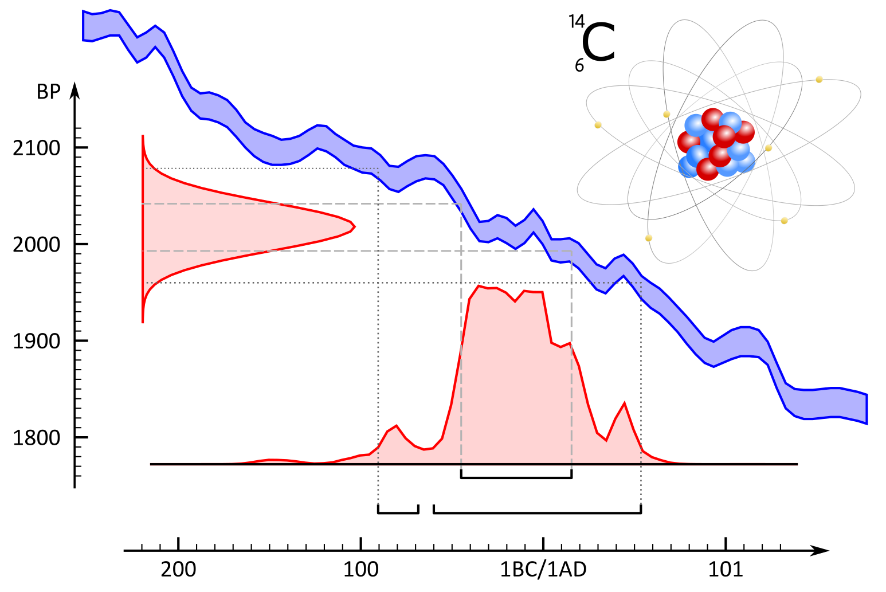

Dateren met radiokoolstof
================

# Dateren met radiokoolstof

Welkom bij de online versie van ***14C: dateren met
radiokoolstof***. Deze handleiding werd in 2019 gepubliceerd door het
agentschap Onroerend Erfgoed en is als pdf te downloaden op de [**Open
Archives Repositiry (OAR)**](https://oar.onroerenderfgoed.be/item/5241).

Met deze online versie willen we kleine aanpassingen aan de originele
uitgave, veranderende inzichten en nieuwe toepassingen van
radiokoolstofonderzoek binnen het erfgoedonderzoek - op basis van
recente, wetenschappelijke ontwikkelingen - sneller ontsluiten. De basis
van deze handleiding blijft de originele uitgave, maar :point\_right:
[**hier**](https://hanecakr.github.io/handleidingRadiokoolstof/)
:point\_left: kan je steeds de meest actuele versie raadplegen.

> Gelieve te citeren als:  
> 
> Haneca K., Ervynck A,, Van Strydonck M. (2020-09-15). 14C:
> dateren met radiokoolstof. Handleiding agentschap Onroerend Erfgoed,
> Brussel. \[online:
> <https://hanecakr.github.io/handleidingRadiokoolstof/>\]
> 
> Oorspronkelijke gepubliceerd als:   Haneca K., Ervynck A,, Van
> Strydonck M. (2019). 14C: dateren met radiokoolstof,
> Handleiding agentschap Onroerend Erfgoed 21, Brussel. \[online:
> <https://oar.onroerenderfgoed.be/item/5241>\].

  Kristof Haneca

  15 september, 2020  

 © agentschap Onroerend Erfgoed
