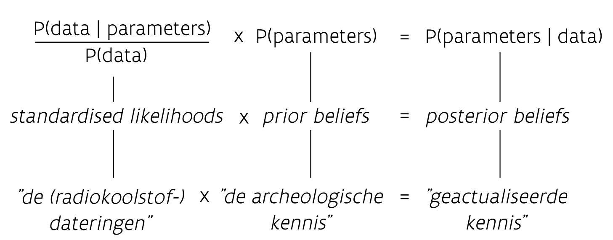
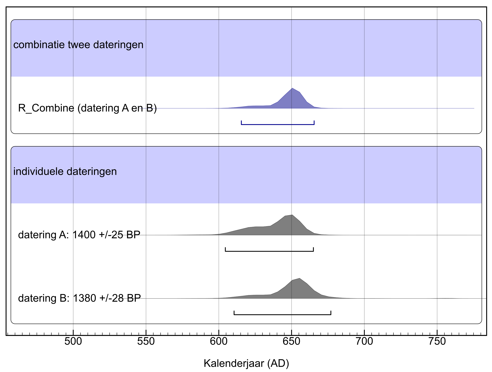
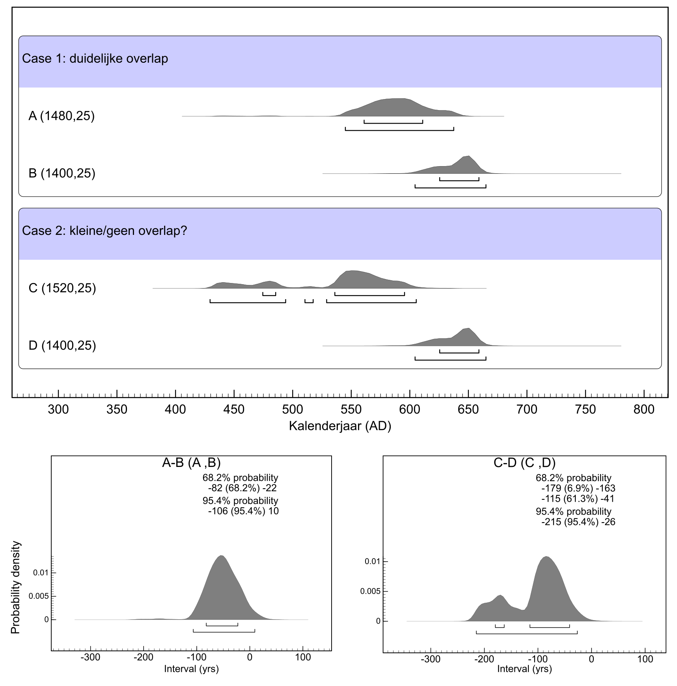
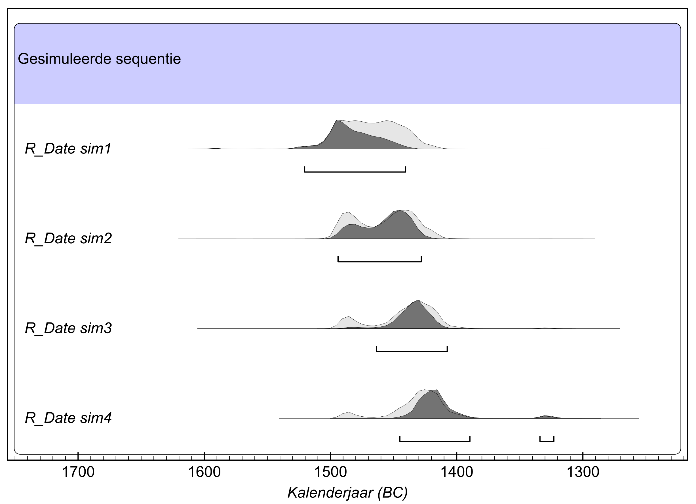
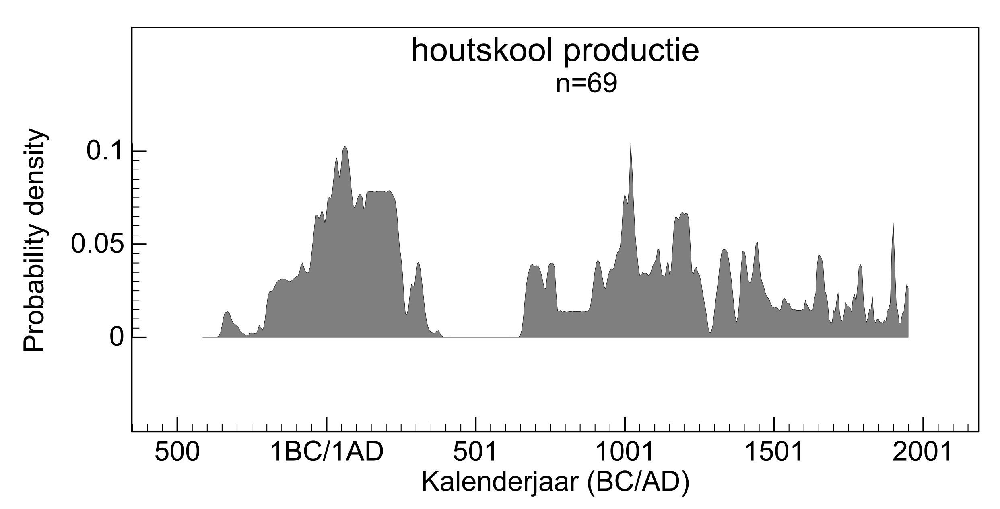
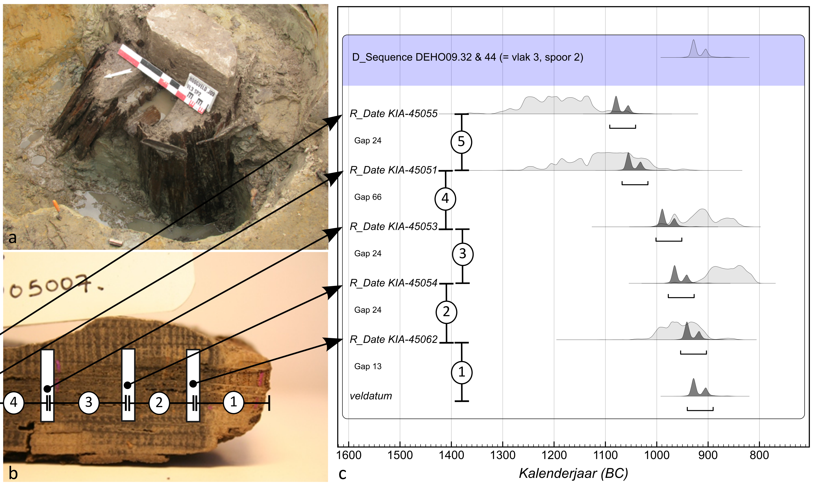

# Bayesiaanse analyse {#modelleren}

## Modellering

De kalibratie van één radiokoolstofdatering is een heel rechtlijnig proces: het levert een tijdsinterval op waarbinnen - met een bepaalde waarschijnlijkheid - de werkelijke ouderdom van het gedateerde materiaal te situeren is. Het wordt al gauw complexer indien van eenzelfde activiteit of fase meerdere dateringen beschikbaar zijn, of wanneer elkaar opvolgende gebeurtenissen zijn gedateerd (met één of meerdere dateringen). Weten we bovendien dat in het laatste geval bepaalde gedateerde stalen onderling ook stratigrafisch in verband staan, dan kan deze kennis aangewend worden om de dateringen te verfijnen. Dit vereist evenwel statistische modellering en complexe berekeningen. De uitwerking van dergelijke vraagstellingen baseert zich op een theorema geformuleerd door de 18de-eeuwse wiskundige Thomas Bayes, dat zich op verbluffend eenvoudige wijze laat formuleren (zie figuur \@ref(fig:Bayes)). De daaruit afgeleide Bayesiaanse statistiek gaat er van uit dat we op basis van nieuw opgedane ervaringen of analyses (in dit geval radiokoolstofdateringen) onze bestaande kennis over het onderzochte erfgoed (gegevens uit het archeologisch of bouwhistorisch onderzoek) evalueren en zodoende tot nieuwe kennis komen (een meer verfijnde datering en/of fasering). Met deze nieuw verworven kennis kan daarna hetzelfde proces opnieuw doorlopen worden, om onze interpretaties verder te verfijnen.

(\#fig:Bayes)De stelling van Bayes, 'vertaald' naar het erfgoedonderzoek.

De eerste component van dit model (de _standardised likelihoods_) omvat de dateringen. Dit zijn de uitgevoerde radiokoolstofmetingen op stalen die relevant zijn voor de vraagstelling. Maar ook andere natuurwetenschappelijke dateringen (dendrochronologische data, luminiscentie of archeomagnetische dateringen, ...), kunnen naast dateringen op basis van muntvondsten of historisch gedocumenteerde gebeurtenissen in overweging genomen worden. In de tweede component van het Bayesiaans model (de _prior beliefs_) wordt onze huidige kennis over de relevante archeologische of bouwkundige contexten formeel vastgelegd in eenvoudige wiskundige formuleringen. Zo kan vanuit stratigrafisch oogpunt soms een relatieve chronologie opgebouwd worden, als we er bijvoorbeeld vanuit kunnen gaan dat materiaal uit dieper gelegen archeologische lagen ouder is dan het materiaal uit bovenliggende lagen. Het onderste, gedateerde staal is dan 'ouder dan' het staal uit een bovenliggende laag. In andere gevallen kan soms geen chronologische opeenvolging vastgesteld worden, maar wel aangenomen worden dat verschillende stalen of vondsten tot eenzelfde organisme of individu, eenzelfde bouw- of bewoningsfase, of tot eenzelfde typologische groep behoren. Ook deze gerelateerdheid is een parameter die kan meegenomen worden in het Bayesiaanse model.

Binnen het archeologisch bodemonderzoek worden de onderlinge verbanden (jonger dan, ouder dan, gelijktijdig met, zelfde fase, ...) tussen sporen en eventuele vondstenconcentraties op een archeologische site visueel voorgesteld in een **Harris-matrix** [@harris_principles_1989]. Het is exact deze informatie die uiterst relevant is om samen met de uitgevoerde radiokoolstofdateringen te evalueren in een Bayesiaans model.

Uiteindelijk wordt het Bayesiaans model gevoed met de beschikbare relevante kennis en resulteert dit in een meer verfijnde interpretatie dan mogelijk was enkel op basis van de individuele componenten. De kalibratie van de individuele radiokoolstofdateringen wordt meer verfijnd door rekening te houden met hun onderlinge verbanden. Indien de in het model opgenomen kennis relevant is voor de gemodelleerde onderzoeksvraag, zal dit uiteindelijk resulteren in gekalibreerde dateringen met een nauwer interval.

## Gelijktijdigheid

Indien er voor een zelfde object of gebeurtenis meerdere radiokoolstofdateringen beschikbaar zijn, kunnen deze gecombineerd worden. Op deze manier tracht men de nauwkeurigheid op de datering te verhogen door meerdere metingen aan elkaar te toetsen. Het kan bijvoorbeeld interessant zijn als uit één graf zowel de kledij (textielresten), een stuk botmateriaal van een individu, alsook een stuk spinthout uit één van de planken van de doodskist zijn gedateerd. Indien we aannemen dat de kist en de kledij kort voor het overlijden van die persoon gemaakt zijn, kan de combinatie van al deze dateringen de sterfdatum beter benaderen dan de individuele dateringen. Andere voorbeelden zijn het combineren van de dateringen op meerdere dierlijke botfragmenten uit eenzelfde afvalcontext, of het uitvoeren van meerdere dateringen op eenzelfde mensenskelet.

Indien de gedateerde stalen afkomstig zijn uit eenzelfde individueel organisme of object - m.a.w. afkomstig van hetzelfde skelet, houten voorwerp, ...) - worden de radiokoolstofdateringen gecombineerd voorafgaand aan de kalibratie (functie `R_Combine()` in OxCal: zie [BIJLAGE II](#Oxcal) en figuur \@ref(fig:Rcombine)). Is er echter niet voldaan aan deze voorwaarde en kunnen we enkel veronderstellen dat de datering van meerdere objecten betrekking heeft op eenzelfde gebeurtenis of activiteit, dan worden de radiokoolstofdateringen pas gecombineerd na kalibratie (functie `Combine()` in OxCal: zie [BIJLAGE II](#Oxcal)). Bij het uitvoeren van dergelijke combinaties wordt ook telkens een statistische test toegepast om na te gaan of de gecombineerde dateringen weldegelijk eenzelfde gebeurtenis kunnen vertegenwoordigen.

(\#fig:Rcombine)Fictief voorbeeld waarbij twee dateringen voorafgaand aan de kalibratie worden gecombineerd.

De vraagstelling kan natuurlijk ook omgedraaid worden: hoe waarschijnlijk is het dat twee dateringen wel of niet eenzelfde gebeurtenis vertegenwoordigen? Om op die vraag te antwoorden kan er een waarschijnlijkheidsdistributie worden opgebouwd voor het veronderstelde chronologisch verschil. Dit geeft dan ook meteen een beeld van het mogelijke chronologische verschil in jaren tussen beide dateringen (functie `Difference()` in OxCal: zie [BIJLAGE II](#Oxcal)). Aangezien radiokoolstofdateringen dikwijls een grillig en breed tijdsinterval hebben na kalibratie, is het niet altijd eenvoudig om (on)gelijktijdigheid vast te stellen indien er slechts een (kleine) overlap is tussen twee dateringen (zie voorbeeld in figuur \@ref(fig:Difference)).

(\#fig:Difference)Waarschijnlijkheidsdistributie van het verschil tussen telkens twee radiokoolstofdateringen (A en B, C en D). Tussen de dateringen A en B is er statistisch gezien geen duidelijk verschil: ze kunnen ook overlappen (interval omvat 0 jaar en meer, met 95,4% probabiliteit). Tussen datering C en D is er een chronologisch verschil: datering C is tussen de 26 en 215 jaar ouder dan D, met 95,4% probabiliteit.

## Sequenties en fasering

Indien de onderlinge samenhang en opeenvolging van radiokoolstofdateringen gekend is, kan deze informatie bijdragen tot een nauwere datering van gebeurtenissen. Door een model op te bouwen, en dit via Bayesiaanse analyse statistisch uit te werken, kunnen verschillende fases en gebeurtenissen nauwkeuriger in de tijd te situeren zijn. Op basis van de individuele dateringen is dergelijke verfijning niet mogelijk. De twee meest voorkomende begrippen die hier van belang zijn, zijn fasen en sequenties:

  - **Fase**: verzameling van gebeurtenissen die samen een coherente, contextuele groep vormen, zonder informatie over de interne chronologische ordening (bv. dateringen uit eenzelfde archeologische laag).
  - **Sequentie**: verzameling van gebeurtenissen die samen een coherente, contextuele groep vormen waarbij de onderlinge chronologische volgorde gekend is (bv. dateringen uit een stratigrafische gelaagdheid).

Binnen een fase is de chronologische verhouding tussen de gedateerde monsters niet gekend. Bij een sequentie is de opeenvolging van de verschillende dateringen wel van belang. Beide groeperingen kunnen door elkaar gebruikt worden. Zo kunnen er binnen één sequentie meerdere fasen aanwezig zijn, waarbij de fasen onderling in stratigrafisch verband te brengen zijn, maar er binnen de verschillende fasen geen chronologische ordening van de dateringen kan opgesteld worden. Door voor een reeks van dateringen de informatie rond hun sequentie (voorafgaand) in het model in te brengen, kan het dateringsinterval op de individuele gekalibreerde dateringen nauwer berekend worden. In onderstaand voorbeeld worden vier gedateerde stalen uit boven elkaar liggende archeologische lagen in een sequentie gemodelleerd. Na modellering zijn de mogelijke kalenderjaren voor elke datering terug te brengen tot een enger interval, doordat rekening is gehouden met de onderlinge samenhang van de individuele dateringen (figuur \@ref(fig:Sequentie)).

(\#fig:Sequentie)Een gemodelleerde sequentie van vier individuele dateringen die elkaar chronologisch opvolgen. De kalibratie van de individuele radiokoolstofdateringen (grijze verdeling) kan door rekening te houden met hun gekende chronologische volgorde, verfijnd worden (zwarte verdeling).

Naast het verfijnen van de dateringen, kan een Bayesiaanse analyse ook een antwoord bieden op vragen die niet rechtstreeks uit de individuele dateringen kunnen afgeleid worden: zoals de duur van een bepaalde fase of het geschatte tijdstip van opgave van een bepaalde site. Deze berekeningen resulteren in een waarschijnlijkheidsverdeling waaruit - met een vooropgestelde probabiliteit - de duur of datering van de gebeurtenis kan worden afgeleid.

De radiokoolstofdateringen die beschikbaar zijn voor één bepaalde sequentie of fase geven niet noodzakelijk een goede afbakening voor het begin en einde van die fase. Hoe minder gedateerde elementen uit het oudste deel van een bepaalde fase, of uit de vroegste fase van een sequentie, hoe minder waarschijnlijk het is dat de oudste datering effectief het oudste element is uit die fase, waardoor je minder zeker bent van de datering van de aanvang van die fase, en van de eventuele sequentie. Hetzelfde geldt - omgekeerd - voor het einde van een fase of een sequentie. OxCal tracht daaraan tegemoet te komen door, uitgaande van de veronderstelling dat de radiokoolstofdateringen uniform tussen begin en eindpunt verspreid liggen, een interval te berekenen waar binnen het werkelijke aanvangs- en eindpunt begrepen is. Dit moet in het model ingevoerd door grenzen - boundaries - te definiëren en zo de verschillende groepen duidelijk af te bakenen. 

## Historische gebeurtenissen en gekende ijkpunten

Gekende historische gebeurtenissen, muntvondsten, of gedateerde documenten kunnen in bepaalde gevallen als ijkpunten gebruikt worden bij het dateren en interpreteren van archeologische vondsten of sporen of van bouwfases in historische gebouwen. De uitgevoerde radiokoolstofdateringen kunnen dan met zekerheid voor of na een bepaalde kalenderdatum gesitueerd worden. Aangezien gekalibreerde radiokoolstofdateringen vaak een ruim dateringsinterval opleveren, kan - indien dit interval een gekende historische datum omvat - deze een _terminus post_ of _ante quem_ voor een individuele radiokoolstofdatering vormen, of zelfs voor een sequentie van radiokoolstofdateringen.

Een dendrochronologische datering kan op een gelijkaardige manier gekoppeld worden aan gerelateerde radiokoolstofdateringen. Indien een kapdatum exact werd bepaald, kan deze dendrochronologische datering een terminus vormen voor de gebeurtenis die men wil dateren (bv. een bouwfase). Een dendrochronologische analyse resulteert soms ook in 'vroegst mogelijke kapdatum' of dateringsinterval waar binnen de werkelijke kapdatum zich situeert. Ook deze dateringsinformatie kan opgenomen worden in een Bayesiaans model.

## Gesommeerde probabiliteiten

Indien uit een bepaalde context, periode of regio een ruim aantal radiokoolstofdateringen van een zelfde cultureel of natuurlijk fenomeen beschikbaar zijn, kan de som van hun probabiliteiten (waarschijnlijkheidsfuncties) meer duidelijkheid bieden over de chronologische spreiding, en het voorkomen van hiaten of piekmomenten in dit fenomeen doorheen de tijd. De gekalibreerde, individuele radiokoolstofdateringen worden bij elkaar opgeteld door de probabiliteit geassocieerd met elke datering per afzonderlijk kalenderjaar te sommeren.

Uit kritische evaluaties van deze methode blijkt echter dat de gesommeerde probabiliteiten met de nodige voorzichtigheid moeten geïnterpreteerd worden [@contreras_summed_2014; @steele_radiocarbon_2010; @williams_use_2012]. De vorm van de kalibratiecurve heeft immers een duidelijke invloed op het eindresultaat en uit de analyses blijkt dat er heel veel radiokoolstofdateringen nodig zijn om tot een stabiel resultaat te komen. De uiteindelijke waarschijnlijkheden (*probability density*) mogen ook niet als absolute waarden geïnterpreteerd worden. Meer geavanceerde statistische methoden, zoals ***kernel density estimates (KDE)***, geven dikwijls een beter en meer betrouwbaar resultaat waarbij eerder de globale trend wordt benadrukt en de scherpe pieken en dalen, die eigen zijn aan gesommeerde probabiliteiten, worden uitgevlakt. Hierbij kan tevens rekening gehouden worden met een ongebalanceerde staalname uit verschillende sites of fasen  [@bevan_rcarbon_2020; @bronk_ramsey_methods_2017; @capuzzo_cremation_2020]. 

Toch geven gesommeerde probabiliteiten van een grote groep van radiokoolstofdateringen al een eerste (ruw) beeld van de evolutie van een bepaald fenomeen doorheen de tijd. Het voorkomen van hiaten kan op deze manier soms duidelijk gevisualiseerd worden (figuur \@ref(fig:Sum)).

Ook van objecten met gelijkaardige stilistische kenmerken - zoals bijvoorbeeld textiel - kan op deze manier de aanvangs- en bloeiperiode in beeld gebracht worden door de beschikbare radiokoolstofdateringen te sommeren en daaruit de meest waarschijnlijke chronologische afbakening af te leiden [@de_moor_radiocarbon_2011].

(\#fig:Sum)Voorbeeld van een probabiliteitssom van 69 radiokoolstofdateringen op stukjes houtskool uit houtskoolmeilers.

## *Wiggle matching* {#wiggle-matching}

Voor het dateren van houten structuren wordt doorgaans eerst aan een dendrochronologisch onderzoek gedacht. Niet alle dendrochronologische analyses leveren echter een datering op. In sommige gevallen laten de opgemeten groeiringpatronen zich niet inpassen in een referentiekalender of worden de stukken hout niet voor datering weerhouden omdat ze te weinig groeiringen hebben (wat de uitkomst van elke analyse onzeker of zelfs onbetrouwbaar maakt). Dan vormt een radiokoolstofdatering van bijvoorbeeld de jongste groeiring het beste alternatief. Dit zal, na kalibratie, echter doorgaans een breed dateringsinterval opleveren. Indien er toch een preciezere datering gewenst is, kan _wiggle-matching_ overwogen worden. Dit is eigenlijk een bijzonder geval van Bayesiaanse modelering. De techniek levert een veel nauwkeuriger datering op dan een individuele $\mathrm{^{14}C}$-datering. Zeker voor het dateren van historische houtconstructies kan deze techniek dus van groot nut zijn.

Op een stuk hout worden dan, aan de hand van het groeiringpatroon, verschillende bemonsteringspunten vastgelegd, met een gekend interval (= aantal jaarringen) tussen de verschillende punten (figuur \@ref(fig:wiggle-matching)). Op elk van deze punten wordt een radiokoolstofanalyse uitgevoerd en de resultaten hiervan in een Bayesiaans model gebracht. De waarschijnlijkheidsdistributies van de individuele dateringen kunnen dan nauwer worden door de met absolute zekerheid gekende sequentie van oud naar jong en het exacte leeftijdsverschil tussen de dateringen in rekening te brengen.

_Wiggle-matching_ biedt ook een uitkomst om houtsoorten te dateren waarvoor geen dendrochronologische kalenders beschikbaar zijn of waarbij de groei en de anatomie de toepassing van de techniek niet toelaten. In principe heeft de houtsoort geen belang zolang er maar jaarringen kunnen onderscheiden worden.

(\#fig:wiggle-matching)Wiggle-matching uitgevoerd op een plank van een waterputbekisting uit de late bronstijd (a). Vijf stalen waarop een radiokoolstofdatering werd uitgevoerd (b) worden in een wiskundig model aan elkaar verbonden door de tussenafstand, uitgedrukt in aantal jaarringen, in het model op te nemen (c). Het opgebouwde model laat toe om de veldatum van dit stuk hout veel preciezer te bepalen dan op basis van de individuele radiokoolstofdateringen mogelijk is.

## Valkuilen

Elk opgebouwd Bayesiaans model kan en moet uiteraard ook statistisch worden gevalideerd. Dit gebeurt aan de hand van statistische testen (*t*-test, $\chi^2$-test) of door het berekenen van een agreement index (zie handleiding OxCal in [BIJLAGE II](#Oxcal) voor meer detail). Een model berekent namelijk steeds een resultaat, maar geeft zonder bijkomende validatie niet aan of dit ook betekenisvol is.

>
>**Een Bayesiaans model is maar zo sterk als de veronderstellingen waarmee het is opgebouwd.**
>

Tot slot moet zeker nog worden opgemerkt dat de Bayesiaanse modellering van radiokoolstofdateringen staat of valt met de kwaliteit en betrouwbaarheid van de veronderstelde prior kennis (figuur \@ref(fig:Bayes)). Wordt verkeerdelijk de datering van intrusief materiaal mee opgenomen in het model, dan loopt de initiële interpretatie van een sequentie fout. Worden de dateringen beïnvloed door een reservoir- of oud-hout-effect, dan zal de uitkomst van het model (de posterior beliefs) betekenisloos zijn. Een Bayesiaans model is maar zo sterk als de veronderstellingen waarmee het is opgebouwd. Tijdens het modelleren van radiokoolstofdateringen dringt zich steeds een kritische evaluatie op van de reeds opgedane, en als 'waarheid' veronderstelde, kennis. 

