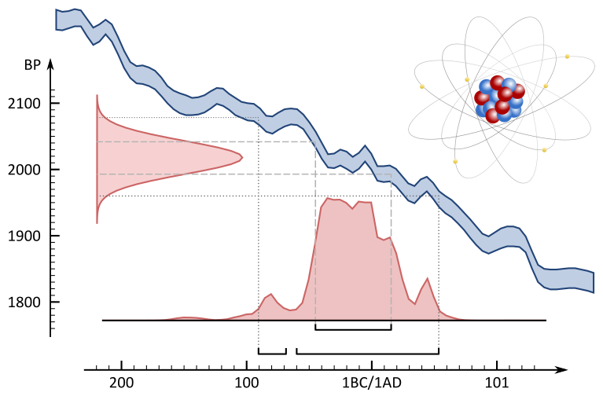

```{r setup, message=TRUE, warning=TRUE, include=FALSE}
library(readxl)
library(tidyverse)
library(kableExtra)

knitr::opts_chunk$set(
  echo = TRUE,
  warning = FALSE,
  collapse = TRUE,
  # fig.path = "./figuren/",
  comment = "#>"
  )

```

# Welkom {-}

## Woord vooraf {-}

Welkom bij de online versie van ***^14^C: dateren met radiokoolstof***. Deze handleiding werd in 2019 gepubliceerd door het agentschap Onroerend Erfgoed en is als pdf te downloaden op de [**Open Archives Repositiry (OAR)**](https://oar.onroerenderfgoed.be/item/5241).

Met deze online versie willen we kleine aanpassingen aan de originele uitgave, veranderende inzichten en nieuwe toepassingen van radiokoolstofonderzoek binnen het erfgoedonderzoek - op basis van recente, wetenschappelijke ontwikkelingen - sneller ontsluiten. De basis van deze handleiding blijft de originele uitgave, maar hier kan je steeds de meest actuele versie raadplegen.

<br/>

## Citeren {-}

Gelieve te citeren als: <br/>

Haneca K., Ervynck A., Van Strydonck M. (`r Sys.Date()`). ^14^C: dateren met radiokoolstof. Handleiding agentschap Onroerend Erfgoed, Brussel. [https://hanecakr.github.io/handleidingRadiokoolstof/]

Oorspronkelijke gepubliceerd als: <br/>

Haneca K., Ervynck A,, Van Strydonck M. (2019). ^14^C: dateren met radiokoolstof, Handleiding agentschap Onroerend Erfgoed 21, Brussel. [https://oar.onroerenderfgoed.be/item/5241].

<br/>

## Auteurs {-}

Kristof Haneca en Anton Ervynck zijn beide erfgoedonderzoekers bij het [*agentschap Onroerend Erfgoed*](https://www.onroerenderfgoed.be/).  
Mark Van Strydonck is het voormalig hoofd van het [laboratorium voor C14-dateringen](https://www.kikirpa.be/nl/wetenschappelijke-analyses/labo-koolstofdatering) aan het *Koninklijk Instituut voor het Kunstpatrimonium (KIK/IRPA)* in Brussel.


{width=100%}

