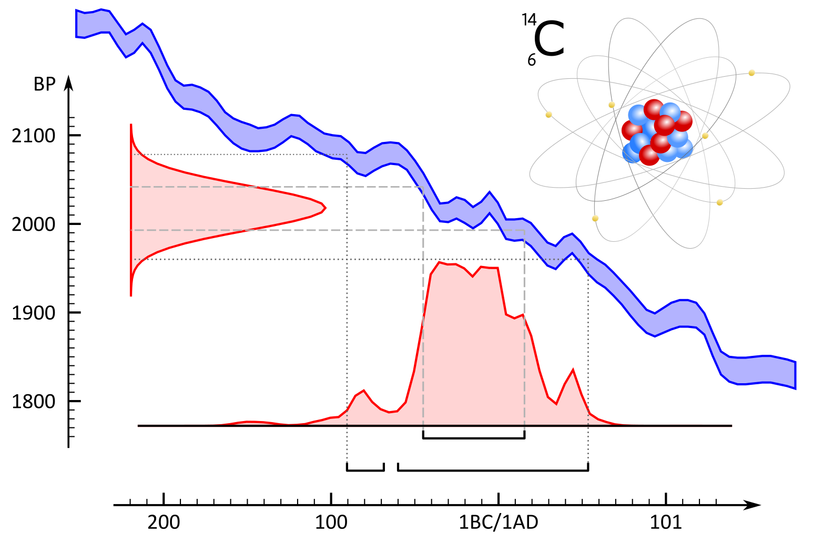

```{r setup, message=TRUE, warning=TRUE, include=FALSE}
library(readxl)
library(tidyverse)
library(kableExtra)

knitr::opts_chunk$set(
  echo = TRUE,
  warning = FALSE,
  collapse = TRUE,
  fig.path = "./figuren/",
  comment = "#>"
  )

```


# Woord vooraf {-}

Welkom bij de online versie van “*^14^C: dateren met radiokoolstof* ”. Deze handleiding werd in 2019 gepubliceerd door
het agentschap Onroerend Erfgoed en is als pdf te downloaden op de [**Open Archives Repositiry (OAR)**](https://oar.onroerenderfgoed.be/item/5241).

Met deze online versie willen we kleine aanpassingen aan de originele uitgave, veranderende inzichten en nieuwe toepassingen van radiokoolstofonderzoek binnen het erfgoedonderzoek - op basis van recente, wetenschappelijke ontwikkelingen - sneller ontsluiten. De basis van deze handleiding blijft de originele uitgave, maar :point_right: [**hier**](https://hanecakr.github.io/handleidingRadiokoolstof/) :point_left: kan je steeds de meest actuele versie raadplegen.


**Gelieve te citeren als:** <br/>

Haneca K., Ervynck A,, Van Strydonck M. (`r Sys.Date()`). ^14^C: dateren met radiokoolstof. Handleiding agentschap Onroerend Erfgoed, Brussel. [online: https://hanecakr.github.io/handleidingRadiokoolstof/]

**Oorspronkelijke gepubliceerd als:** <br/>

Haneca K., Ervynck A,, Van Strydonck M. (2019). ^14^C: dateren met radiokoolstof, Handleiding agentschap Onroerend Erfgoed 21, Brussel. [online: https://oar.onroerenderfgoed.be/item/5241].


 <br/>
 Kristof Haneca <br/>
`r format(Sys.time(), '%d %B, %Y')`<br/>
 [](https://www.researchgate.net/profile/Kristof_Haneca)
 
 
 
